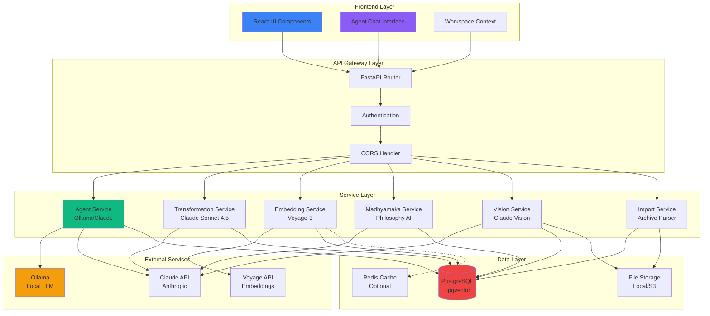
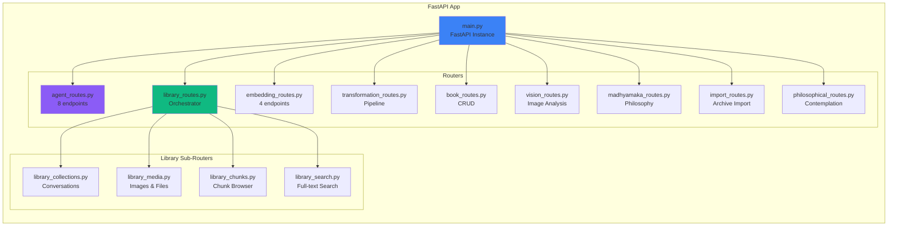
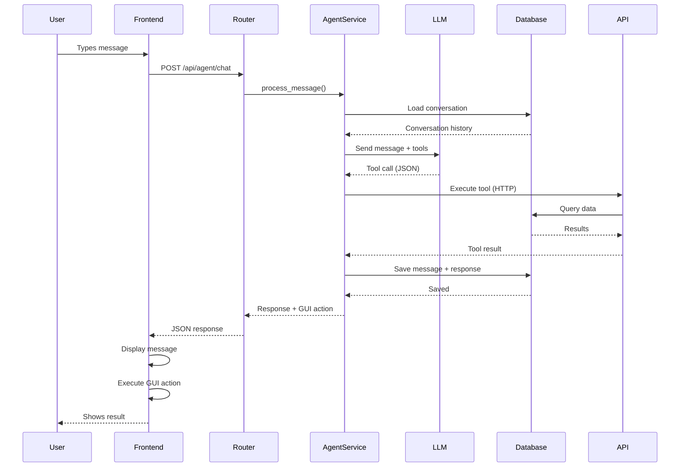
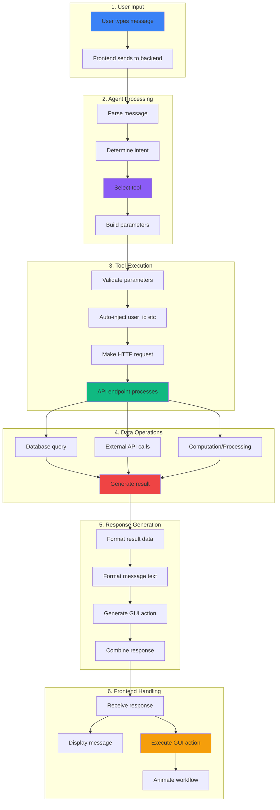
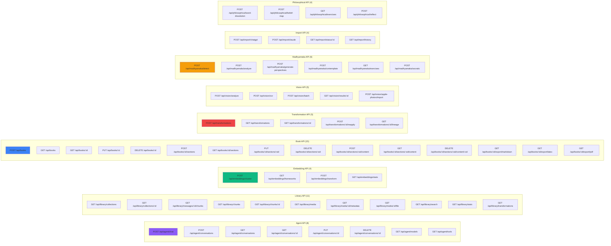
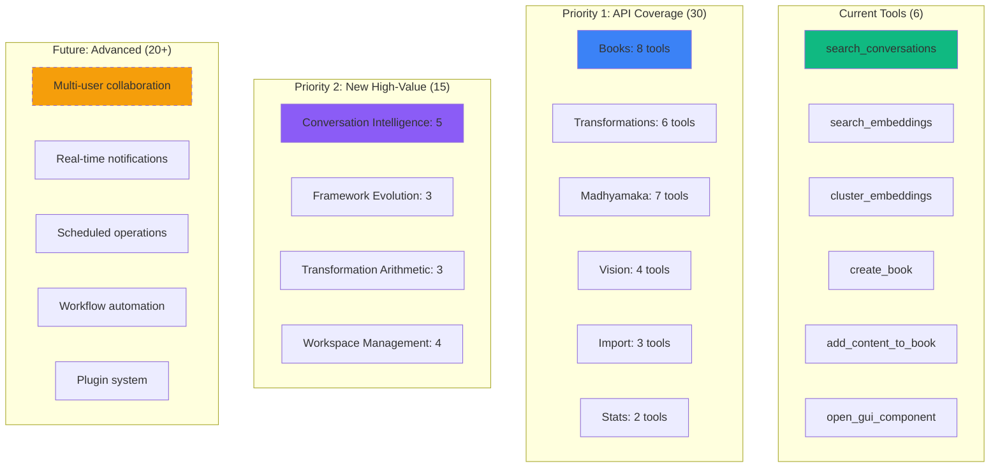

# API Architecture: Visual Diagrams & Flowcharts
## Complete System Architecture with Extensions

**Version:** 1.0
**Date:** October 2025
**Format:** Mermaid diagrams + PlantUML + detailed specifications

---

## Table of Contents

1. [Complete API Overview](#complete-api-overview)
2. [Data Flow Architecture](#data-flow-architecture)
3. [AUI Tool Flow Diagrams](#aui-tool-flow-diagrams)
4. [Current API Endpoints Map](#current-api-endpoints-map)
5. [Proposed AUI Extensions](#proposed-aui-extensions)
6. [Proposed API Extensions](#proposed-api-extensions)
7. [Integration Architecture](#integration-architecture)

---

## Complete API Overview

### High-Level System Architecture



### API Router Organization



---

## Data Flow Architecture

### Request → Response Flow



### Database Query Flow (Embeddings)

```mermaid
graph TD
    START[User Request:<br/>"Find chunks about Buddhism"]

    PARSE[Agent Service:<br/>Parse intent]

    TOOL[Select Tool:<br/>search_embeddings]

    PARAMS[Build Parameters:<br/>search='Buddhism'<br/>has_embedding=true<br/>limit=50]

    API[Call API:<br/>GET /api/library/chunks]

    QUERY{Query Type?}

    SEMANTIC[Semantic Search:<br/>Vector similarity]
    KEYWORD[Keyword Search:<br/>Full-text]
    FILTER[Filter Only:<br/>has_embedding=true]

    EMBED[Get embedding<br/>for query]
    VECTOR[pgvector search:<br/>ORDER BY embedding <=> query]

    TEXT[PostgreSQL FTS:<br/>to_tsvector search]

    WHERE[WHERE clause:<br/>embedding IS NOT NULL]

    RESULTS[Result Set:<br/>Chunks with metadata]

    COUNT[Count total matches]
    PAGINATE[Apply limit/offset]

    FORMAT[Format Response:<br/>JSON with provenance]

    GUI[Generate GUI Action:<br/>Open ChunkBrowser]

    RETURN[Return to Frontend]

    START --> PARSE
    PARSE --> TOOL
    TOOL --> PARAMS
    PARAMS --> API
    API --> QUERY

    QUERY -->|Has search term| SEMANTIC
    QUERY -->|Has search term| KEYWORD
    QUERY -->|No search term| FILTER

    SEMANTIC --> EMBED
    EMBED --> VECTOR
    KEYWORD --> TEXT
    FILTER --> WHERE

    VECTOR --> RESULTS
    TEXT --> RESULTS
    WHERE --> RESULTS

    RESULTS --> COUNT
    COUNT --> PAGINATE
    PAGINATE --> FORMAT
    FORMAT --> GUI
    GUI --> RETURN

    style START fill:#3B82F6
    style SEMANTIC fill:#10B981
    style GUI fill:#8B5CF6
    style RETURN fill:#EF4444
```

---

## AUI Tool Flow Diagrams

### Tool 1: search_embeddings

```mermaid
graph TD
    INPUT["User: 'Find chunks about Buddhism'"]

    INTERPRET[Agent interprets:<br/>Semantic search needed]

    BUILD[Build tool call:<br/>tool: search_embeddings<br/>params: {search: 'Buddhism'}]

    EXECUTE[Execute tool:<br/>GET /api/library/chunks?search=Buddhism]

    EMBED[Generate embedding<br/>for 'Buddhism']

    SEARCH[Vector similarity search<br/>embedding <=> chunk_embeddings]

    RANK[Rank by similarity:<br/>Top 50 results]

    FETCH[Fetch chunk data:<br/>content, metadata, provenance]

    COUNT[Count total: 4,449]

    FORMAT[Format response:<br/>{chunks: [...], total: 4449}]

    GUI[Generate GUI action:<br/>{type: 'open_tab',<br/>component: 'ChunkBrowser',<br/>data: results}]

    RESPOND[Agent response:<br/>'Found 4,449 chunks...<br/>Opening ChunkBrowser']

    FRONTEND[Frontend receives:<br/>message + gui_action]

    OPEN[Open ChunkBrowser tab<br/>with results]

    ANIMATE[Future: Animate<br/>manual workflow]

    INPUT --> INTERPRET
    INTERPRET --> BUILD
    BUILD --> EXECUTE
    EXECUTE --> EMBED
    EMBED --> SEARCH
    SEARCH --> RANK
    RANK --> FETCH
    FETCH --> COUNT
    COUNT --> FORMAT
    FORMAT --> GUI
    GUI --> RESPOND
    RESPOND --> FRONTEND
    FRONTEND --> OPEN
    OPEN -.-> ANIMATE

    style INPUT fill:#3B82F6
    style EMBED fill:#10B981
    style GUI fill:#8B5CF6
    style ANIMATE fill:#F59E0B,stroke-dasharray: 5 5
```

### Tool 2: cluster_embeddings

```mermaid
graph TD
    INPUT["User: 'Show me frameworks'"]

    INTERPRET[Agent interprets:<br/>Framework discovery via clustering]

    BUILD[Build tool call:<br/>tool: cluster_embeddings<br/>params: {limit: 1000,<br/>min_cluster_size: 25}]

    EXECUTE[Execute tool:<br/>POST /api/embeddings/cluster]

    FETCH[Fetch embeddings:<br/>SELECT * FROM embeddings<br/>LIMIT 1000]

    UMAP[UMAP reduction:<br/>1024 dims → 3 dims]

    HDBSCAN[HDBSCAN clustering:<br/>Find density-based clusters]

    ANALYZE[Analyze clusters:<br/>- Top words per cluster<br/>- Representative chunks<br/>- Time ranges<br/>- Sizes]

    LABEL[Generate labels:<br/>'Phenomenological Framework'<br/>'Buddhist Emptiness'<br/>etc.]

    COORDS[Store 3D coordinates<br/>for visualization]

    FORMAT[Format response:<br/>{clusters: 8,<br/>frameworks: [...],<br/>coordinates: [...]}]

    GUI[Generate GUI action:<br/>{type: 'open_tab',<br/>component: 'ClusterExplorer',<br/>data: visualization}]

    RESPOND[Agent response:<br/>'Discovered 8 frameworks...<br/>Opening visualization']

    FRONTEND[Frontend receives:<br/>message + gui_action]

    OPEN[Open ClusterExplorer<br/>with Plotly 3D viz]

    INPUT --> INTERPRET
    INTERPRET --> BUILD
    BUILD --> EXECUTE
    EXECUTE --> FETCH
    FETCH --> UMAP
    UMAP --> HDBSCAN
    HDBSCAN --> ANALYZE
    ANALYZE --> LABEL
    LABEL --> COORDS
    COORDS --> FORMAT
    FORMAT --> GUI
    GUI --> RESPOND
    RESPOND --> FRONTEND
    FRONTEND --> OPEN

    style INPUT fill:#3B82F6
    style UMAP fill:#10B981
    style HDBSCAN fill:#10B981
    style GUI fill:#8B5CF6
```

### Tool 3: create_book

```mermaid
graph TD
    INPUT["User: 'Create a book called<br/>Emptiness Studies'"]

    INTERPRET[Agent interprets:<br/>Book creation needed]

    BUILD[Build tool call:<br/>tool: create_book<br/>params: {title: 'Emptiness Studies',<br/>book_type: 'paper',<br/>user_id: auto-inject}]

    EXECUTE[Execute tool:<br/>POST /api/books]

    VALIDATE[Validate params:<br/>- Title exists<br/>- Book type valid<br/>- User ID valid]

    CREATE[Create book record:<br/>INSERT INTO books]

    SECTION[Create default section:<br/>'Introduction']

    METADATA[Initialize metadata:<br/>- Created timestamp<br/>- Default config<br/>- Empty content]

    COMMIT[Commit transaction:<br/>Save to database]

    FETCH[Fetch created book:<br/>SELECT * FROM books<br/>WHERE id = new_id]

    FORMAT[Format response:<br/>{id: 'abc123...',<br/>title: 'Emptiness Studies',<br/>sections: [...]}]

    GUI[Generate GUI action:<br/>{type: 'open_tab',<br/>component: 'BookBuilder',<br/>data: {bookId: 'abc123...'}}]

    RESPOND[Agent response:<br/>'Created book "Emptiness Studies"<br/>(ID: abc123...)<br/>Opening BookBuilder']

    FRONTEND[Frontend receives:<br/>message + gui_action]

    OPEN[Open BookBuilder tab<br/>with new book loaded]

    INPUT --> INTERPRET
    INTERPRET --> BUILD
    BUILD --> EXECUTE
    EXECUTE --> VALIDATE
    VALIDATE --> CREATE
    CREATE --> SECTION
    SECTION --> METADATA
    METADATA --> COMMIT
    COMMIT --> FETCH
    FETCH --> FORMAT
    FORMAT --> GUI
    GUI --> RESPOND
    RESPOND --> FRONTEND
    FRONTEND --> OPEN

    style INPUT fill:#3B82F6
    style CREATE fill:#10B981
    style GUI fill:#8B5CF6
```

### Complete Tool Execution Pipeline



---

## Current API Endpoints Map

### Complete API Matrix (All Endpoints)



### API Coverage by Function

| Function | Endpoints | AUI Tools | Coverage |
|----------|-----------|-----------|----------|
| **Agent System** | 8 | N/A | 100% |
| **Search & Browse** | 11 | 2 (search_conversations, search_embeddings) | 18% |
| **Embeddings** | 4 | 1 (cluster_embeddings) | 25% |
| **Books** | 15 | 2 (create_book, add_content_to_book) | 13% |
| **Transformations** | 5 | 0 | 0% |
| **Vision** | 5 | 0 | 0% |
| **Madhyamaka** | 6 | 0 | 0% |
| **Import** | 4 | 0 | 0% |
| **Philosophy** | 4 | 0 | 0% |
| **GUI Control** | N/A | 1 (open_gui_component) | N/A |
| **TOTAL** | **62** | **6** | **~10%** |

**Observation:** Only ~10% of API functionality is accessible via AUI!

---

## Proposed AUI Extensions

### Priority 1: Complete Coverage of Existing API (30 new tools)

#### Book Management Tools (8 tools)

```javascript
// 1. List books
{
  name: "list_books",
  description: "List all books for the user, optionally filtered by type",
  endpoint: {
    method: "GET",
    path: "/api/books"
  },
  parameters: {
    book_type: {
      type: "string",
      description: "Filter by type: 'paper', 'book', 'article', 'report'",
      required: false
    }
  },
  gui_component: "BookLibrary"
}

// 2. Get book details
{
  name: "get_book",
  description: "Get full details of a specific book including sections",
  endpoint: {
    method: "GET",
    path: "/api/books/{book_id}"
  },
  parameters: {
    book_id: {
      type: "string",
      description: "Book UUID",
      required: true
    }
  },
  gui_component: "BookBuilder"
}

// 3. Update book
{
  name: "update_book",
  description: "Update book title, subtitle, or type",
  endpoint: {
    method: "PUT",
    path: "/api/books/{book_id}"
  },
  parameters: {
    book_id: {type: "string", required: true},
    title: {type: "string", required: false},
    subtitle: {type: "string", required: false},
    book_type: {type: "string", required: false}
  },
  gui_component: null
}

// 4. Delete book
{
  name: "delete_book",
  description: "Delete a book and all its sections",
  endpoint: {
    method: "DELETE",
    path: "/api/books/{book_id}"
  },
  parameters: {
    book_id: {type: "string", required: true}
  },
  gui_component: null,
  confirmation_required: true  // New: Require user confirmation
}

// 5. Create book section
{
  name: "create_book_section",
  description: "Add a new section to a book",
  endpoint: {
    method: "POST",
    path: "/api/books/{book_id}/sections"
  },
  parameters: {
    book_id: {type: "string", required: true},
    title: {type: "string", required: true},
    order_index: {type: "integer", required: false},
    parent_section_id: {type: "string", required: false}  // For nested sections
  },
  gui_component: "BookBuilder"
}

// 6. Update book section
{
  name: "update_book_section",
  description: "Update section title, content, or order",
  endpoint: {
    method: "PUT",
    path: "/api/books/{book_id}/sections/{section_id}"
  },
  parameters: {
    book_id: {type: "string", required: true},
    section_id: {type: "string", required: true},
    title: {type: "string", required: false},
    content: {type: "string", required: false},
    order_index: {type: "integer", required: false}
  },
  gui_component: null
}

// 7. Delete book section
{
  name: "delete_book_section",
  description: "Delete a section from a book",
  endpoint: {
    method: "DELETE",
    path: "/api/books/{book_id}/sections/{section_id}"
  },
  parameters: {
    book_id: {type: "string", required: true},
    section_id: {type: "string", required: true}
  },
  gui_component: null,
  confirmation_required: true
}

// 8. Export book
{
  name: "export_book",
  description: "Export book as markdown, LaTeX, or PDF",
  endpoint: {
    method: "GET",
    path: "/api/books/{book_id}/export/{format}"
  },
  parameters: {
    book_id: {type: "string", required: true},
    format: {
      type: "string",
      description: "Export format: 'markdown', 'latex', 'pdf'",
      required: true
    }
  },
  gui_component: null,
  returns_file: true  // New: Indicates file download
}
```

#### Transformation Tools (6 tools)

```javascript
// 9. Transform chunk
{
  name: "transform_chunk",
  description: "Transform a chunk using PERSONA/NAMESPACE/STYLE",
  endpoint: {
    method: "POST",
    path: "/api/transformations"
  },
  parameters: {
    chunk_id: {type: "string", required: true},
    persona: {
      type: "string",
      description: "Voice: 'scholar', 'poet', 'skeptic', 'engineer', etc.",
      required: true
    },
    namespace: {
      type: "string",
      description: "Domain: 'academic', 'spiritual', 'technical', etc.",
      required: true
    },
    style: {
      type: "string",
      description: "Tone: 'formal', 'conversational', 'lyrical', etc.",
      required: true
    },
    user_id: {type: "string", required: true, auto_inject: true}
  },
  gui_component: "TransformationLab",
  background_job: true  // New: Runs as background job
}

// 10. List transformations
{
  name: "list_transformations",
  description: "List transformation jobs, optionally filtered",
  endpoint: {
    method: "GET",
    path: "/api/transformations"
  },
  parameters: {
    status: {
      type: "string",
      description: "Filter by status: 'pending', 'running', 'complete', 'failed'",
      required: false
    },
    limit: {type: "integer", default: 50}
  },
  gui_component: "TransformationsLibrary"
}

// 11. Get transformation
{
  name: "get_transformation",
  description: "Get details of a transformation job including result",
  endpoint: {
    method: "GET",
    path: "/api/transformations/{job_id}"
  },
  parameters: {
    job_id: {type: "string", required: true}
  },
  gui_component: "TransformationLab"
}

// 12. Reapply transformation
{
  name: "reapply_transformation",
  description: "Reapply a previous transformation to new content",
  endpoint: {
    method: "POST",
    path: "/api/transformations/{job_id}/reapply"
  },
  parameters: {
    job_id: {type: "string", required: true},
    chunk_id: {type: "string", required: true}
  },
  gui_component: "TransformationLab",
  background_job: true
}

// 13. Get transformation lineage
{
  name: "get_transformation_lineage",
  description: "Get full lineage tree of transformations",
  endpoint: {
    method: "GET",
    path: "/api/transformations/{job_id}/lineage"
  },
  parameters: {
    job_id: {type: "string", required: true}
  },
  gui_component: "LineageGraph"  // New component: Graph visualization
}

// 14. Batch transform
{
  name: "batch_transform",
  description: "Transform multiple chunks with same parameters",
  endpoint: {
    method: "POST",
    path: "/api/transformations/batch"  // NEW ENDPOINT
  },
  parameters: {
    chunk_ids: {type: "array", items: "string", required: true},
    persona: {type: "string", required: true},
    namespace: {type: "string", required: true},
    style: {type: "string", required: true},
    user_id: {type: "string", required: true, auto_inject: true}
  },
  gui_component: "TransformationsLibrary",
  background_job: true
}
```

#### Madhyamaka & Philosophy Tools (7 tools)

```javascript
// 15. Detect Madhyamaka
{
  name: "detect_madhyamaka",
  description: "Detect Middle Path reasoning in text",
  endpoint: {
    method: "POST",
    path: "/api/madhyamaka/detect"
  },
  parameters: {
    text: {type: "string", required: true}
  },
  gui_component: null
}

// 16. Analyze philosophical patterns
{
  name: "analyze_philosophy",
  description: "Deep philosophical analysis of text",
  endpoint: {
    method: "POST",
    path: "/api/madhyamaka/analyze"
  },
  parameters: {
    chunk_id: {type: "string", required: true}
  },
  gui_component: "PhilosophyAnalyzer"  // New component
}

// 17. Generate perspectives
{
  name: "generate_perspectives",
  description: "Generate multiple philosophical perspectives on text",
  endpoint: {
    method: "POST",
    path: "/api/madhyamaka/generate-perspectives"
  },
  parameters: {
    chunk_id: {type: "string", required: true},
    count: {
      type: "integer",
      description: "Number of perspectives to generate",
      default: 3
    }
  },
  gui_component: "PerspectiveViewer"  // New component
}

// 18. Contemplation exercise
{
  name: "start_contemplation",
  description: "Start a contemplative exercise (word dissolution, Socratic dialogue)",
  endpoint: {
    method: "POST",
    path: "/api/philosophical/contemplate"
  },
  parameters: {
    exercise_type: {
      type: "string",
      description: "'word-dissolution', 'socratic', 'belief-map', 'epoché'",
      required: true
    },
    text: {type: "string", required: true}
  },
  gui_component: "ContemplationSpace"  // New component
}

// 19. List exercises
{
  name: "list_contemplation_exercises",
  description: "List available contemplative exercises",
  endpoint: {
    method: "GET",
    path: "/api/philosophical/exercises"
  },
  parameters: {},
  gui_component: "ExerciseLibrary"  // New component
}

// 20. Belief structure map
{
  name: "map_beliefs",
  description: "Generate belief structure visualization",
  endpoint: {
    method: "POST",
    path: "/api/philosophical/belief-map"
  },
  parameters: {
    conversation_id: {type: "string", required: false},
    chunk_ids: {type: "array", items: "string", required: false}
  },
  gui_component: "BeliefMapViewer"  // New component: Graph viz
}

// 21. Socratic dialogue
{
  name: "socratic_dialogue",
  description: "Start Socratic questioning dialogue",
  endpoint: {
    method: "POST",
    path: "/api/madhyamaka/socratic"
  },
  parameters: {
    initial_claim: {type: "string", required: true}
  },
  gui_component: "SocraticSpace",  // New component
  conversational: true  // New: Multi-turn conversation mode
}
```

#### Vision & Media Tools (4 tools)

```javascript
// 22. Analyze image
{
  name: "analyze_image",
  description: "Analyze image using Claude Vision API",
  endpoint: {
    method: "POST",
    path: "/api/vision/analyze"
  },
  parameters: {
    media_id: {type: "string", required: true},
    prompt: {
      type: "string",
      description: "Analysis prompt (optional)",
      required: false
    }
  },
  gui_component: "ImageViewer"
}

// 23. OCR image
{
  name: "ocr_image",
  description: "Extract text from image using OCR",
  endpoint: {
    method: "POST",
    path: "/api/vision/ocr"
  },
  parameters: {
    media_id: {type: "string", required: true}
  },
  gui_component: "ImageViewer"
}

// 24. Search images
{
  name: "search_images",
  description: "Search media/images by generator, prompt, or date",
  endpoint: {
    method: "GET",
    path: "/api/library/media"
  },
  parameters: {
    generator: {
      type: "string",
      description: "Filter by generator: 'dalle', 'midjourney', 'stable-diffusion'",
      required: false
    },
    search: {type: "string", required: false},
    limit: {type: "integer", default: 100}
  },
  gui_component: "ImageBrowser"
}

// 25. Import Apple Photos
{
  name: "import_apple_photos",
  description: "Import images from Apple Photos library",
  endpoint: {
    method: "POST",
    path: "/api/vision/apple-photos/import"
  },
  parameters: {
    album_name: {type: "string", required: false},
    date_from: {type: "string", required: false},
    date_to: {type: "string", required: false}
  },
  gui_component: "ImportProgress",  // New component
  background_job: true
}
```

#### Import & Archive Tools (3 tools)

```javascript
// 26. Import ChatGPT archive
{
  name: "import_chatgpt",
  description: "Import ChatGPT conversations.json export",
  endpoint: {
    method: "POST",
    path: "/api/import/chatgpt"
  },
  parameters: {
    file_path: {
      type: "string",
      description: "Path to conversations.json (uploaded via file picker)",
      required: true
    },
    user_id: {type: "string", required: true, auto_inject: true}
  },
  gui_component: "ImportProgress",
  background_job: true
}

// 27. Import Claude archive
{
  name: "import_claude",
  description: "Import Claude conversation export",
  endpoint: {
    method: "POST",
    path: "/api/import/claude"
  },
  parameters: {
    file_path: {type: "string", required: true},
    user_id: {type: "string", required: true, auto_inject: true}
  },
  gui_component: "ImportProgress",
  background_job: true
}

// 28. Check import status
{
  name: "check_import_status",
  description: "Check status of archive import job",
  endpoint: {
    method: "GET",
    path: "/api/import/status/{job_id}"
  },
  parameters: {
    job_id: {type: "string", required: true}
  },
  gui_component: null
}
```

#### Statistics & Analysis Tools (2 tools)

```javascript
// 29. Get library statistics
{
  name: "get_library_stats",
  description: "Get statistics about conversation archive",
  endpoint: {
    method: "GET",
    path: "/api/library/stats"
  },
  parameters: {},
  gui_component: "LibraryStats"  // New component: Dashboard
}

// 30. Get embedding statistics
{
  name: "get_embedding_stats",
  description: "Get embedding coverage and quality metrics",
  endpoint: {
    method: "GET",
    path: "/api/embeddings/stats"
  },
  parameters: {},
  gui_component: "EmbeddingStats"
}
```

### Priority 2: New High-Value Tools (15 new tools)

#### Conversation Intelligence (5 tools)

```javascript
// 31. Find related conversations
{
  name: "find_related_conversations",
  description: "Find conversations related to current one (semantic similarity)",
  endpoint: {
    method: "GET",
    path: "/api/library/collections/{id}/related"  // NEW ENDPOINT
  },
  parameters: {
    conversation_id: {type: "string", required: true},
    limit: {type: "integer", default: 10}
  },
  gui_component: "RelatedConversations"  // New component
}

// 32. Conversation timeline
{
  name: "get_conversation_timeline",
  description: "Get temporal view of conversations on a topic",
  endpoint: {
    method: "POST",
    path: "/api/library/timeline"  // NEW ENDPOINT
  },
  parameters: {
    query: {type: "string", required: true},
    date_from: {type: "string", required: false},
    date_to: {type: "string", required: false}
  },
  gui_component: "TimelineViewer"  // New component: Timeline viz
}

// 33. Conversation threads
{
  name: "trace_conversation_thread",
  description: "Trace a topic across multiple conversations over time",
  endpoint: {
    method: "POST",
    path: "/api/library/threads"  // NEW ENDPOINT
  },
  parameters: {
    seed_conversation_id: {type: "string", required: true},
    depth: {
      type: "integer",
      description: "How many hops to follow",
      default: 3
    }
  },
  gui_component: "ThreadGraph"  // New component: Network graph
}

// 34. Summarize conversation
{
  name: "summarize_conversation",
  description: "Generate AI summary of conversation",
  endpoint: {
    method: "POST",
    path: "/api/library/collections/{id}/summarize"  // NEW ENDPOINT
  },
  parameters: {
    conversation_id: {type: "string", required: true},
    style: {
      type: "string",
      description: "'brief', 'detailed', 'bullet-points'",
      default: "detailed"
    }
  },
  gui_component: null
}

// 35. Extract key insights
{
  name: "extract_insights",
  description: "Extract key insights/quotes from conversation",
  endpoint: {
    method: "POST",
    path: "/api/library/collections/{id}/insights"  // NEW ENDPOINT
  },
  parameters: {
    conversation_id: {type: "string", required: true},
    count: {type: "integer", default: 5}
  },
  gui_component: "InsightsPanel"  // New component
}
```

#### Framework Evolution (3 tools)

```javascript
// 36. Framework evolution over time
{
  name: "track_framework_evolution",
  description: "Track how belief frameworks evolved over time",
  endpoint: {
    method: "POST",
    path: "/api/embeddings/evolution"  // NEW ENDPOINT
  },
  parameters: {
    framework_id: {type: "string", required: true},
    date_from: {type: "string", required: false},
    date_to: {type: "string", required: false}
  },
  gui_component: "EvolutionGraph"  // New component: Time-series
}

// 37. Compare frameworks
{
  name: "compare_frameworks",
  description: "Compare two belief frameworks for similarities/differences",
  endpoint: {
    method: "POST",
    path: "/api/embeddings/compare-frameworks"  // NEW ENDPOINT
  },
  parameters: {
    framework_id_1: {type: "string", required: true},
    framework_id_2: {type: "string", required: true}
  },
  gui_component: "FrameworkComparison"  // New component: Side-by-side
}

// 38. Detect framework shift
{
  name: "detect_framework_shift",
  description: "Detect when user's perspective shifted on a topic",
  endpoint: {
    method: "POST",
    path: "/api/embeddings/detect-shift"  // NEW ENDPOINT
  },
  parameters: {
    topic: {type: "string", required: true},
    date_from: {type: "string", required: false},
    date_to: {type: "string", required: false}
  },
  gui_component: "ShiftAnalysis"  // New component: Narrative viz
}
```

#### Transformation Arithmetic (3 tools)

```javascript
// 39. Learn transformation vector
{
  name: "learn_transformation",
  description: "Learn a transformation vector from examples",
  endpoint: {
    method: "POST",
    path: "/api/embeddings/transform"
  },
  parameters: {
    source_chunk_id: {type: "string", required: true},
    target_chunk_id: {type: "string", required: true},
    name: {type: "string", required: true}  // Name for this transformation
  },
  gui_component: "TransformationLab"
}

// 40. Apply transformation vector
{
  name: "apply_transformation_vector",
  description: "Apply learned transformation to new chunk",
  endpoint: {
    method: "POST",
    path: "/api/embeddings/apply-transform"  // NEW ENDPOINT
  },
  parameters: {
    chunk_id: {type: "string", required: true},
    transformation_name: {type: "string", required: true}
  },
  gui_component: "TransformationLab"
}

// 41. Compose transformations
{
  name: "compose_transformations",
  description: "Compose multiple transformations (e.g., skeptical + academic)",
  endpoint: {
    method: "POST",
    path: "/api/embeddings/compose"  // NEW ENDPOINT
  },
  parameters: {
    chunk_id: {type: "string", required: true},
    transformation_names: {type: "array", items: "string", required: true}
  },
  gui_component: "TransformationLab"
}
```

#### Workspace Management (4 tools)

```javascript
// 42. Save workspace state
{
  name: "save_workspace",
  description: "Save current workspace (open tabs, filters, etc.)",
  endpoint: {
    method: "POST",
    path: "/api/workspace/save"  // NEW ENDPOINT
  },
  parameters: {
    name: {type: "string", required: true},
    state: {
      type: "object",
      description: "JSON of workspace state",
      required: true
    },
    user_id: {type: "string", required: true, auto_inject: true}
  },
  gui_component: null
}

// 43. Load workspace state
{
  name: "load_workspace",
  description: "Restore a saved workspace",
  endpoint: {
    method: "GET",
    path: "/api/workspace/load/{name}"  // NEW ENDPOINT
  },
  parameters: {
    name: {type: "string", required: true}
  },
  gui_component: null,
  restores_ui: true  // New: Indicates UI restoration
}

// 44. List workspaces
{
  name: "list_workspaces",
  description: "List saved workspaces",
  endpoint: {
    method: "GET",
    path: "/api/workspace/list"  // NEW ENDPOINT
  },
  parameters: {},
  gui_component: "WorkspaceManager"  // New component
}

// 45. Create workspace preset
{
  name: "create_workspace_preset",
  description: "Create reusable workspace template",
  endpoint: {
    method: "POST",
    path: "/api/workspace/presets"  // NEW ENDPOINT
  },
  parameters: {
    name: {type: "string", required: true},
    description: {type: "string", required: false},
    template: {type: "object", required: true}
  },
  gui_component: "WorkspaceManager"
}
```

### Tool Organization by Category



---

## Proposed API Extensions

### New Endpoints Needed (25 endpoints)

#### Library Extensions

```
POST /api/library/collections/{id}/related
GET  /api/library/collections/{id}/summarize
POST /api/library/collections/{id}/insights
POST /api/library/timeline
POST /api/library/threads
```

#### Embedding Extensions

```
POST /api/embeddings/evolution
POST /api/embeddings/compare-frameworks
POST /api/embeddings/detect-shift
POST /api/embeddings/apply-transform
POST /api/embeddings/compose
```

#### Transformation Extensions

```
POST /api/transformations/batch
```

#### Workspace Management (NEW)

```
POST /api/workspace/save
GET  /api/workspace/load/{name}
GET  /api/workspace/list
POST /api/workspace/presets
GET  /api/workspace/presets
DELETE /api/workspace/{name}
```

#### Notification System (NEW)

```
GET  /api/notifications
POST /api/notifications/mark-read
GET  /api/notifications/subscribe
WebSocket /api/notifications/stream
```

#### Workflow Automation (NEW)

```
POST /api/workflows
GET  /api/workflows
GET  /api/workflows/{id}
POST /api/workflows/{id}/execute
GET  /api/workflows/{id}/history
```

#### User Preferences (NEW)

```
GET  /api/preferences
PUT  /api/preferences
POST /api/preferences/reset
```

### Critical New APIs

#### 1. Related Content API

**Purpose:** Find semantically similar content across all data types

**Endpoints:**
```python
# Find related chunks
POST /api/library/chunks/{id}/related
{
  "chunk_id": "abc123",
  "limit": 10,
  "min_similarity": 0.7
}
→ Returns: List of related chunks with similarity scores

# Find related conversations
POST /api/library/collections/{id}/related
{
  "conversation_id": "def456",
  "limit": 5
}
→ Returns: List of related conversations

# Find related across types
POST /api/library/related
{
  "source_id": "abc123",
  "source_type": "chunk",
  "target_types": ["chunk", "conversation", "media"],
  "limit": 20
}
→ Returns: Mixed results from all types
```

#### 2. Timeline & Evolution API

**Purpose:** Track how ideas/frameworks evolve over time

**Endpoints:**
```python
# Get timeline view
POST /api/library/timeline
{
  "query": "phenomenology",
  "date_from": "2024-01-01",
  "date_to": "2024-12-31",
  "granularity": "month"  # day, week, month, year
}
→ Returns: Time-series data with conversation counts

# Framework evolution
POST /api/embeddings/evolution
{
  "framework_id": "phenomenology-cluster-5",
  "date_from": "2024-01-01",
  "date_to": "2024-12-31"
}
→ Returns: How framework changed over time

# Detect shifts
POST /api/embeddings/detect-shift
{
  "topic": "consciousness",
  "window_size": "3 months"
}
→ Returns: Identified shift points with analysis
```

#### 3. Workspace State API

**Purpose:** Save/restore UI state for repeatable workflows

**Endpoints:**
```python
# Save workspace
POST /api/workspace/save
{
  "name": "buddhism-research",
  "state": {
    "tabs": [
      {"type": "chunks", "filters": {"search": "Buddhism"}},
      {"type": "clusterExplorer", "params": {"limit": 1000}}
    ],
    "sidebar": "agentChat",
    "inspectorPane": "messageViewer"
  }
}
→ Returns: Saved workspace ID

# Load workspace
GET /api/workspace/load/buddhism-research
→ Returns: Full state object

# List workspaces
GET /api/workspace/list
→ Returns: Array of saved workspaces
```

#### 4. Batch Operations API

**Purpose:** Process multiple items efficiently

**Endpoints:**
```python
# Batch transform
POST /api/transformations/batch
{
  "chunk_ids": ["id1", "id2", "id3"],
  "persona": "academic",
  "namespace": "philosophy",
  "style": "formal"
}
→ Returns: Batch job ID

# Batch export
POST /api/books/batch-export
{
  "book_ids": ["book1", "book2"],
  "format": "pdf"
}
→ Returns: ZIP file with all exports

# Batch embedding generation
POST /api/embeddings/batch-generate
{
  "chunk_ids": ["id1", "id2", ...],  # Or filter criteria
  "priority": "high"
}
→ Returns: Batch job ID
```

#### 5. Notification & Real-time API

**Purpose:** Keep user informed of background operations

**Endpoints:**
```python
# Get notifications
GET /api/notifications
→ Returns: Array of notifications

# WebSocket for real-time updates
WebSocket /api/notifications/stream
→ Streams: {
  "type": "transformation_complete",
  "job_id": "abc123",
  "message": "Transformation finished: 'Academic perspective on emptiness'",
  "timestamp": "2025-10-08T12:00:00Z"
}
```

**Continue to Part 2...**
