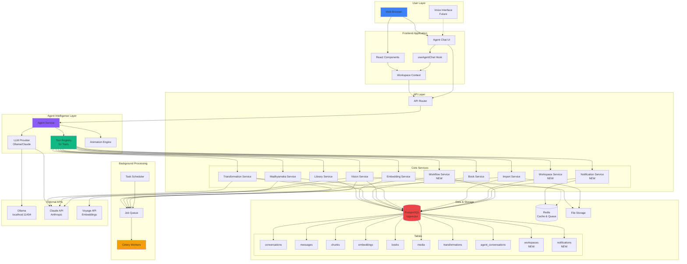
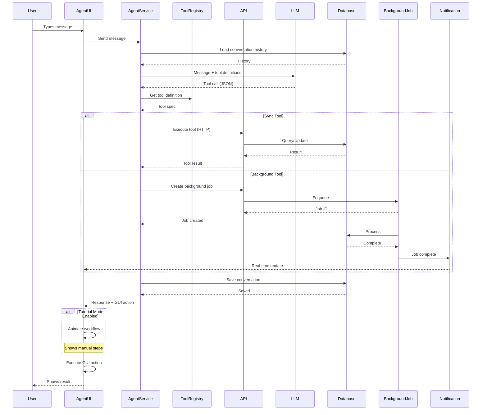
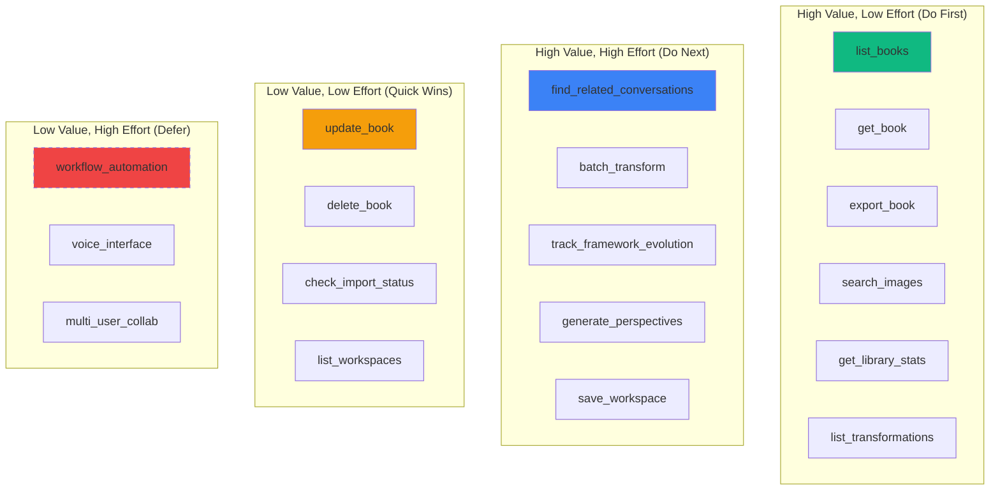

# API Architecture Part 2: Integration & Implementation
## Integration Diagrams and Implementation Roadmap

**Version:** 1.0
**Date:** October 2025

---

## Integration Architecture

### Complete System Integration



### Agent Tool Execution Flow (Extended)



### Tool Organization & Dependencies

```mermaid
graph TB
    subgraph "Foundation Tools (6)"
        F1[search_conversations]
        F2[search_embeddings]
        F3[cluster_embeddings]
        F4[create_book]
        F5[add_content_to_book]
        F6[open_gui_component]
    end

    subgraph "Book Management (8)"
        B1[list_books]
        B2[get_book]
        B3[update_book]
        B4[delete_book]
        B5[create_book_section]
        B6[update_book_section]
        B7[delete_book_section]
        B8[export_book]
    end

    subgraph "Transformation Tools (6)"
        T1[transform_chunk]
        T2[list_transformations]
        T3[get_transformation]
        T4[reapply_transformation]
        T5[get_transformation_lineage]
        T6[batch_transform]
    end

    subgraph "Philosophy & Analysis (7)"
        P1[detect_madhyamaka]
        P2[analyze_philosophy]
        P3[generate_perspectives]
        P4[start_contemplation]
        P5[list_contemplation_exercises]
        P6[map_beliefs]
        P7[socratic_dialogue]
    end

    subgraph "Vision & Media (4)"
        V1[analyze_image]
        V2[ocr_image]
        V3[search_images]
        V4[import_apple_photos]
    end

    subgraph "Import & Archive (3)"
        I1[import_chatgpt]
        I2[import_claude]
        I3[check_import_status]
    end

    subgraph "Intelligence Tools (5)"
        N1[find_related_conversations]
        N2[get_conversation_timeline]
        N3[trace_conversation_thread]
        N4[summarize_conversation]
        N5[extract_insights]
    end

    subgraph "Framework Evolution (3)"
        E1[track_framework_evolution]
        E2[compare_frameworks]
        E3[detect_framework_shift]
    end

    subgraph "Advanced Embeddings (3)"
        A1[learn_transformation]
        A2[apply_transformation_vector]
        A3[compose_transformations]
    end

    subgraph "Workspace Management (4)"
        W1[save_workspace]
        W2[load_workspace]
        W3[list_workspaces]
        W4[create_workspace_preset]
    end

    subgraph "Statistics (2)"
        S1[get_library_stats]
        S2[get_embedding_stats]
    end

    F2 --> N1
    F2 --> N4
    F2 --> N5
    F3 --> E1
    F3 --> E2
    F4 --> B1
    F4 --> B2
    F5 --> B5
    F5 --> B6
    B2 --> B8
    T1 --> T2
    T1 --> T6
    T3 --> T4
    T3 --> T5
    F2 --> P6
    F3 --> P6
    F2 --> A1
    A1 --> A2
    A2 --> A3

    style F1 fill:#10B981
    style B1 fill:#3B82F6
    style T1 fill:#EF4444
    style P1 fill:#F59E0B
    style N1 fill:#8B5CF6
```



---

## Database Schema Extensions

### New Tables Required

```sql
-- Workspaces table
CREATE TABLE workspaces (
  id UUID PRIMARY KEY DEFAULT uuid_generate_v4(),
  user_id UUID NOT NULL REFERENCES users(id) ON DELETE CASCADE,
  name VARCHAR(200) NOT NULL,
  description TEXT,
  state JSONB NOT NULL,  -- Full workspace state
  is_preset BOOLEAN DEFAULT false,  -- Template vs instance
  created_at TIMESTAMPTZ DEFAULT NOW(),
  updated_at TIMESTAMPTZ DEFAULT NOW(),
  UNIQUE(user_id, name)
);

CREATE INDEX idx_workspaces_user_id ON workspaces(user_id);
CREATE INDEX idx_workspaces_is_preset ON workspaces(is_preset);

-- Notifications table
CREATE TABLE notifications (
  id UUID PRIMARY KEY DEFAULT uuid_generate_v4(),
  user_id UUID NOT NULL REFERENCES users(id) ON DELETE CASCADE,
  type VARCHAR(50) NOT NULL,  -- 'transformation_complete', 'import_complete', etc.
  title VARCHAR(200) NOT NULL,
  message TEXT NOT NULL,
  data JSONB,  -- Related data (job_id, etc.)
  is_read BOOLEAN DEFAULT false,
  created_at TIMESTAMPTZ DEFAULT NOW(),
  expires_at TIMESTAMPTZ  -- Optional expiration
);

CREATE INDEX idx_notifications_user_id ON notifications(user_id);
CREATE INDEX idx_notifications_is_read ON notifications(is_read);
CREATE INDEX idx_notifications_created_at ON notifications(created_at DESC);

-- Workflows table (automation)
CREATE TABLE workflows (
  id UUID PRIMARY KEY DEFAULT uuid_generate_v4(),
  user_id UUID NOT NULL REFERENCES users(id) ON DELETE CASCADE,
  name VARCHAR(200) NOT NULL,
  description TEXT,
  trigger JSONB NOT NULL,  -- Trigger conditions
  actions JSONB NOT NULL,  -- Array of actions to execute
  enabled BOOLEAN DEFAULT true,
  last_run_at TIMESTAMPTZ,
  created_at TIMESTAMPTZ DEFAULT NOW(),
  updated_at TIMESTAMPTZ DEFAULT NOW()
);

CREATE INDEX idx_workflows_user_id ON workflows(user_id);
CREATE INDEX idx_workflows_enabled ON workflows(enabled);

-- Workflow executions (history)
CREATE TABLE workflow_executions (
  id UUID PRIMARY KEY DEFAULT uuid_generate_v4(),
  workflow_id UUID NOT NULL REFERENCES workflows(id) ON DELETE CASCADE,
  status VARCHAR(20) NOT NULL,  -- 'running', 'complete', 'failed'
  trigger_data JSONB,  -- What triggered this execution
  result JSONB,  -- Execution result
  error TEXT,  -- If failed
  started_at TIMESTAMPTZ DEFAULT NOW(),
  completed_at TIMESTAMPTZ
);

CREATE INDEX idx_workflow_executions_workflow_id ON workflow_executions(workflow_id);
CREATE INDEX idx_workflow_executions_status ON workflow_executions(status);

-- Framework evolution tracking
CREATE TABLE framework_snapshots (
  id UUID PRIMARY KEY DEFAULT uuid_generate_v4(),
  framework_id VARCHAR(100) NOT NULL,  -- e.g., 'phenomenology-cluster-5'
  snapshot_date DATE NOT NULL,
  cluster_data JSONB NOT NULL,  -- Cluster characteristics at this time
  top_chunks JSONB,  -- Representative chunks
  created_at TIMESTAMPTZ DEFAULT NOW(),
  UNIQUE(framework_id, snapshot_date)
);

CREATE INDEX idx_framework_snapshots_framework_id ON framework_snapshots(framework_id);
CREATE INDEX idx_framework_snapshots_snapshot_date ON framework_snapshots(snapshot_date);

-- Related content cache (for performance)
CREATE TABLE related_content_cache (
  id UUID PRIMARY KEY DEFAULT uuid_generate_v4(),
  source_id UUID NOT NULL,
  source_type VARCHAR(50) NOT NULL,  -- 'chunk', 'conversation', 'media'
  related_items JSONB NOT NULL,  -- Array of {id, type, similarity}
  computed_at TIMESTAMPTZ DEFAULT NOW(),
  expires_at TIMESTAMPTZ NOT NULL,  -- Cache expiration
  UNIQUE(source_id, source_type)
);

CREATE INDEX idx_related_content_source ON related_content_cache(source_id, source_type);
CREATE INDEX idx_related_content_expires ON related_content_cache(expires_at);
```

### Updated Indexes for Performance

```sql
-- Optimize conversation timeline queries
CREATE INDEX idx_conversations_created_at_topic ON conversations(created_at, source_platform);

-- Optimize framework queries
CREATE INDEX idx_chunks_embedding_created ON chunks(embedding IS NOT NULL, created_at);

-- Optimize transformation queries
CREATE INDEX idx_transformations_status_created ON transformation_jobs(status, created_at DESC);

-- Full-text search optimization
CREATE INDEX idx_chunks_fts ON chunks USING GIN(to_tsvector('english', content));
CREATE INDEX idx_conversations_fts ON conversations USING GIN(to_tsvector('english', title));

-- Vector similarity optimization (already have HNSW, but add covering index)
CREATE INDEX idx_embeddings_vector_chunk ON embeddings(embedding, chunk_id);
```

---

## Implementation Roadmap

### Phase 1: Foundation Extensions (Q4 2025)

**Goal:** Essential tools for daily workflows

**New Tools (15):**
- ✅ Book Management: list_books, get_book, update_book, create_section, update_section, delete_section, export_book (7)
- ✅ Transformation: list_transformations, get_transformation, batch_transform (3)
- ✅ Statistics: get_library_stats, get_embedding_stats (2)
- ✅ Vision: search_images, analyze_image, ocr_image (3)

**New APIs:**
```
POST /api/transformations/batch
POST /api/vision/batch
```

**Database:**
- No new tables required
- Add indexes for performance

**Deliverables:**
- 15 new tools implemented
- 2 new API endpoints
- Tutorial animations for top 5 tools
- Documentation updated

**Timeline:** 4 weeks

---

### Phase 2: Intelligence Layer (Q1 2026)

**Goal:** Smart content discovery and analysis

**New Tools (10):**
- ✅ Conversation Intelligence: find_related, timeline, threads, summarize, insights (5)
- ✅ Framework Evolution: track_evolution, compare_frameworks, detect_shift (3)
- ✅ Import: import_chatgpt, import_claude, check_status (2 + extension)

**New APIs:**
```
POST /api/library/collections/{id}/related
POST /api/library/collections/{id}/summarize
POST /api/library/collections/{id}/insights
POST /api/library/timeline
POST /api/library/threads
POST /api/embeddings/evolution
POST /api/embeddings/compare-frameworks
POST /api/embeddings/detect-shift
```

**Database:**
- `framework_snapshots` table
- `related_content_cache` table

**Deliverables:**
- 10 new tools
- 8 new API endpoints
- New components: TimelineViewer, ThreadGraph, EvolutionGraph
- Background job system for heavy computations

**Timeline:** 6 weeks

---

### Phase 3: Philosophy Deepening (Q2 2026)

**Goal:** Full philosophical analysis capabilities

**New Tools (7):**
- ✅ Madhyamaka: detect, analyze, perspectives, contemplate, exercises, belief_map, socratic (7)

**New APIs:**
```
POST /api/madhyamaka/detect
POST /api/madhyamaka/analyze
POST /api/madhyamaka/generate-perspectives
POST /api/philosophical/contemplate
GET  /api/philosophical/exercises
POST /api/philosophical/belief-map
POST /api/madhyamaka/socratic
```

**New Components:**
- PhilosophyAnalyzer
- PerspectiveViewer
- ContemplationSpace
- ExerciseLibrary
- BeliefMapViewer
- SocraticSpace

**Deliverables:**
- 7 new tools
- 7 new API endpoints
- 6 new UI components
- Contemplative exercise library (20+ exercises)

**Timeline:** 6 weeks

---

### Phase 4: Advanced Embeddings (Q2 2026)

**Goal:** Transformation arithmetic and vector operations

**New Tools (3):**
- ✅ learn_transformation
- ✅ apply_transformation_vector
- ✅ compose_transformations

**New APIs:**
```
POST /api/embeddings/learn-transform
POST /api/embeddings/apply-transform
POST /api/embeddings/compose
```

**Deliverables:**
- 3 new tools
- 3 new API endpoints
- Enhanced TransformationLab UI
- Vector algebra visualization

**Timeline:** 3 weeks

---

### Phase 5: Workspace & Automation (Q3 2026)

**Goal:** Repeatable workflows and automation

**New Tools (8):**
- ✅ Workspace: save, load, list, presets (4)
- ✅ Workflow: create, execute, list, history (4 - NEW)

**New APIs:**
```
POST /api/workspace/save
GET  /api/workspace/load/{name}
GET  /api/workspace/list
POST /api/workspace/presets
POST /api/workflows
GET  /api/workflows
GET  /api/workflows/{id}
POST /api/workflows/{id}/execute
GET  /api/workflows/{id}/history
```

**Database:**
- `workspaces` table
- `workflows` table
- `workflow_executions` table

**New Components:**
- WorkspaceManager
- WorkflowBuilder (visual workflow editor)
- WorkflowHistory

**Deliverables:**
- 8 new tools
- 9 new API endpoints
- 3 new UI components
- Workflow templates library

**Timeline:** 5 weeks

---

### Phase 6: Real-time & Notifications (Q3 2026)

**Goal:** Keep users informed of background operations

**New APIs:**
```
GET       /api/notifications
POST      /api/notifications/mark-read
WebSocket /api/notifications/stream
GET       /api/notifications/subscribe
```

**Database:**
- `notifications` table

**Infrastructure:**
- Redis for pub/sub
- WebSocket server
- Background job monitoring

**Deliverables:**
- Notification system
- Real-time updates for:
  - Transformation jobs
  - Import jobs
  - Clustering operations
  - Workflow executions
- Toast notifications in UI
- Notification center component

**Timeline:** 4 weeks

---

### Phase 7: Voice Interface (Q4 2026)

**Goal:** Speech-to-text and text-to-speech

**Features:**
- Voice input for agent chat
- Spoken responses from agent
- Hands-free operation
- Voice commands for common actions

**APIs:**
```
WebSocket /api/voice/stream
POST      /api/voice/synthesize
GET       /api/voice/commands
```

**Deliverables:**
- Web Speech API integration
- Voice command library
- Accessibility enhancements
- Tutorial voice-overs

**Timeline:** 4 weeks

---

## Tool Priority Matrix

### By User Value & Implementation Effort



### Implementation Sequence

**Week 1-2: Quick Wins (8 tools)**
1. list_books
2. get_book
3. update_book
4. delete_book
5. search_images
6. get_library_stats
7. get_embedding_stats
8. list_transformations

**Week 3-4: Essential Book Tools (4 tools)**
9. create_book_section
10. update_book_section
11. delete_book_section
12. export_book

**Week 5-6: Transformation Tools (3 tools)**
13. get_transformation
14. batch_transform
15. reapply_transformation

**Week 7-8: Vision & Import (4 tools)**
16. analyze_image
17. ocr_image
18. import_chatgpt
19. import_claude

---

## Tool Testing Strategy

### Automated Testing

```python
# test_aui_tools.py

import pytest
from agent_service import AgentService, TOOLS

@pytest.fixture
def agent():
    return AgentService(model_name="mistral:7b", user_id="test-user")

class TestToolExecution:
    """Test each tool executes correctly"""

    async def test_search_embeddings(self, agent):
        result, gui_action = await agent.execute_tool(
            "search_embeddings",
            {"search": "Buddhism", "limit": 10}
        )
        assert "chunks" in result
        assert gui_action["component"] == "ChunkBrowser"

    async def test_cluster_embeddings(self, agent):
        result, gui_action = await agent.execute_tool(
            "cluster_embeddings",
            {"limit": 100, "min_cluster_size": 5}
        )
        assert "clusters_found" in result
        assert gui_action["component"] == "ClusterExplorer"

    async def test_create_book(self, agent):
        result, gui_action = await agent.execute_tool(
            "create_book",
            {"title": "Test Book", "book_type": "paper"}
        )
        assert "id" in result
        assert gui_action["component"] == "BookBuilder"

    # ... test all 51 tools

class TestToolChaining:
    """Test tools can be chained together"""

    async def test_search_then_add_to_book(self, agent):
        # 1. Search for chunks
        search_result, _ = await agent.execute_tool(
            "search_embeddings",
            {"search": "emptiness", "limit": 5}
        )
        chunk_ids = [c["id"] for c in search_result["chunks"]]

        # 2. Create book
        book_result, _ = await agent.execute_tool(
            "create_book",
            {"title": "Emptiness Studies"}
        )
        book_id = book_result["id"]

        # 3. Get first section
        sections_result = await get_book_sections(book_id)
        section_id = sections_result[0]["id"]

        # 4. Add chunks to section
        for chunk_id in chunk_ids:
            await agent.execute_tool(
                "add_content_to_book",
                {"book_id": book_id, "section_id": section_id, "chunk_id": chunk_id}
            )

        # Verify
        section_content = await get_section_content(book_id, section_id)
        assert len(section_content) == 5

class TestErrorHandling:
    """Test tools handle errors gracefully"""

    async def test_invalid_book_id(self, agent):
        with pytest.raises(Exception) as exc:
            await agent.execute_tool(
                "get_book",
                {"book_id": "invalid-uuid"}
            )
        assert "not found" in str(exc.value).lower()

    async def test_missing_required_param(self, agent):
        with pytest.raises(Exception) as exc:
            await agent.execute_tool(
                "create_book",
                {}  # Missing title
            )
        assert "required" in str(exc.value).lower()
```

### Integration Testing

```python
# test_aui_integration.py

class TestAgentWorkflows:
    """Test complete user workflows via agent"""

    async def test_research_workflow(self):
        """
        User: "Find Buddhism chunks, cluster them, create a book"
        """
        messages = []

        # 1. Search
        response = await agent.process_message(
            "Find chunks about Buddhism",
            messages
        )
        assert response["type"] == "tool_call"
        assert response["tool_calls"][0]["tool"] == "search_embeddings"

        # 2. Cluster
        messages.append({"role": "user", "content": "Now cluster these results"})
        response = await agent.process_message(
            "Now cluster these results",
            messages
        )
        assert response["tool_calls"][0]["tool"] == "cluster_embeddings"

        # 3. Create book
        messages.append({"role": "user", "content": "Create a book called 'Buddhism Research'"})
        response = await agent.process_message(
            "Create a book called 'Buddhism Research'",
            messages
        )
        assert response["tool_calls"][0]["tool"] == "create_book"
```

---

## Performance Optimization

### Caching Strategy

```python
# Cache expensive operations

# 1. Embedding generation (cache in Redis)
@cache(ttl=3600)  # 1 hour
async def get_chunk_embedding(chunk_id: str):
    # Check cache first
    # Generate if not found
    pass

# 2. Clustering results (cache in DB)
@cache_db(expires_in=timedelta(days=7))
async def cluster_embeddings(params: ClusterParams):
    # Check if identical clustering was done recently
    # Return cached if found
    pass

# 3. Related content (cache in DB)
@cache_db(expires_in=timedelta(days=1))
async def find_related(source_id: str, source_type: str):
    # Use related_content_cache table
    pass
```

### Query Optimization

```python
# Optimize common queries

# 1. Batch load chunks with embeddings
SELECT c.*, e.embedding
FROM chunks c
LEFT JOIN embeddings e ON c.id = e.chunk_id
WHERE c.id = ANY($1)  # Use ANY for IN queries

# 2. Paginated search with total count
WITH results AS (
  SELECT *, COUNT(*) OVER() AS total_count
  FROM chunks
  WHERE to_tsvector('english', content) @@ to_tsquery($1)
  ORDER BY created_at DESC
  LIMIT $2 OFFSET $3
)
SELECT * FROM results;

# 3. Vector similarity with pre-filtering
SELECT c.*, 1 - (e.embedding <=> $1) AS similarity
FROM chunks c
JOIN embeddings e ON c.id = e.chunk_id
WHERE e.embedding IS NOT NULL
  AND c.token_count >= $2
ORDER BY e.embedding <=> $1
LIMIT $3;
```

---

## Summary

### What We've Designed

**Current State:**
- 6 AUI tools
- 62 API endpoints
- ~10% API coverage via AUI

**Proposed State:**
- 51 AUI tools (8.5x increase)
- 87 API endpoints (25 new)
- ~80% API coverage via AUI

**New Capabilities:**
1. Complete book management
2. Batch transformations
3. Philosophical analysis
4. Framework evolution tracking
5. Workspace management
6. Workflow automation
7. Real-time notifications
8. Voice interface

**Database Additions:**
- 5 new tables
- 15 new indexes
- 3 new caching tables

**Implementation Timeline:**
- Phase 1: 4 weeks (15 tools)
- Phase 2: 6 weeks (10 tools)
- Phase 3: 6 weeks (7 tools)
- Phase 4: 3 weeks (3 tools)
- Phase 5: 5 weeks (8 tools)
- Phase 6: 4 weeks (notifications)
- Phase 7: 4 weeks (voice)
- **Total: 32 weeks (~8 months)**

### Next Steps

1. **Prioritize:** Review priority matrix, confirm sequence
2. **Prototype:** Build top 5 high-value tools first
3. **Test:** Comprehensive testing strategy for each tool
4. **Document:** API docs for each new endpoint
5. **Animate:** Tutorial animations for top 10 tools
6. **Deploy:** Phased rollout with beta testing

---

**Questions for Discussion:**

1. Which 5 tools should we prioritize first?
2. Should we implement batching before individual operations?
3. How important is workspace management vs. more tools?
4. Should notifications be real-time or polling-based?
5. Voice interface in scope for 2026?

---

*Last Updated: October 2025*
*Part 2 of 2*
