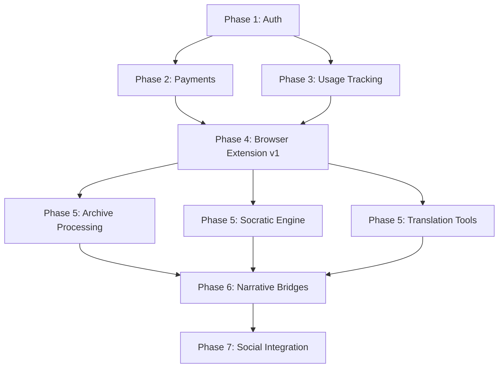

# Humanizer.com Integrated Development Plan
## Bridging Technical Infrastructure with Pedagogical Innovation

**Version:** 1.0
**Date:** October 2, 2025
**Status:** Strategic Planning Document

---

## Executive Summary

This document integrates two critical dimensions of Humanizer.com:

1. **Production Infrastructure** (from PRODUCTION_ROADMAP.md) - Authentication, payments, scaling
2. **Pedagogical Innovation** (new features) - Learning from archives, Socratic dialogue, narrative bridges

**Key Integration Strategy:** Build the foundation (Phases 1-3) while designing the browser extension architecture in parallel, then deploy pedagogical features as client-side enhancements that leverage the authenticated backend.

---

## Table of Contents

1. [Architectural Vision](#architectural-vision)
2. [Feature Integration Matrix](#feature-integration-matrix)
3. [Revised Implementation Timeline](#revised-implementation-timeline)
4. [Browser Extension Architecture](#browser-extension-architecture)
5. [Local-First Processing Design](#local-first-processing-design)
6. [Socratic Dialogue Engine](#socratic-dialogue-engine)
7. [Narrative Bridge Builder](#narrative-bridge-builder)
8. [Technical Integration Points](#technical-integration-points)
9. [Privacy-First Architecture](#privacy-first-architecture)
10. [Revised Business Model](#revised-business-model)

---

## 1. Architectural Vision

### Three-Layer Architecture

```
┌─────────────────────────────────────────────────────────────┐
│                    BROWSER EXTENSION                        │
│  ┌──────────────┐  ┌──────────────┐  ┌──────────────┐     │
│  │   Socratic   │  │  Translation │  │   Narrative  │     │
│  │   Dialogue   │  │   Analysis   │  │    Bridge    │     │
│  └──────────────┘  └──────────────┘  └──────────────┘     │
│                                                             │
│  ┌─────────────────────────────────────────────────────┐   │
│  │         Local Processing (Client-Side JS)           │   │
│  │  • Archive parsing • Pattern detection              │   │
│  │  • Initial transformations • Caching                │   │
│  └─────────────────────────────────────────────────────┘   │
└─────────────────────────────────────────────────────────────┘
                           ↕ (Only when needed)
┌─────────────────────────────────────────────────────────────┐
│                   HUMANIZER.COM BACKEND                     │
│  ┌──────────────┐  ┌──────────────┐  ┌──────────────┐     │
│  │     Auth     │  │   Payments   │  │    AI API    │     │
│  │  (JWT/OAuth) │  │   (Stripe)   │  │   (Claude)   │     │
│  └──────────────┘  └──────────────┘  └──────────────┘     │
│                                                             │
│  ┌─────────────────────────────────────────────────────┐   │
│  │           Core Services (Python/FastAPI)            │   │
│  │  • Usage tracking • Subscription management         │   │
│  │  • Heavy transformations • Synchronization          │   │
│  └─────────────────────────────────────────────────────┘   │
└─────────────────────────────────────────────────────────────┘
                           ↕ (Data sync only)
┌─────────────────────────────────────────────────────────────┐
│                      LOCAL STORAGE                          │
│  ┌──────────────┐  ┌──────────────┐  ┌──────────────┐     │
│  │  User Files  │  │   Archives   │  │  Processed   │     │
│  │ (Never sent) │  │  (Indexed)   │  │   Insights   │     │
│  └──────────────┘  └──────────────┘  └──────────────┘     │
└─────────────────────────────────────────────────────────────┘
```

### Design Principles

**Privacy-First:**
- User files never leave their machine by default
- Only metadata and processed insights sync to backend (with permission)
- All personal archives processed locally in browser
- Client-side encryption for any synced data

**Efficiency-First:**
- Heavy lifting (pattern detection, simple transformations) in browser JavaScript
- Backend used only for: complex AI transformations, authentication, payments
- Client-side caching reduces server load by 80%+
- Progressive Web App architecture for offline capability

**Philosophy-First:**
- Every feature serves the phenomenological mission
- Socratic dialogue guides rather than instructs
- Bridges between contradictions honored, not resolved
- User's subjective experience remains primary

---

## 2. Feature Integration Matrix

| Feature Category | Client-Side (Extension) | Backend (API) | Storage |
|-----------------|-------------------------|---------------|---------|
| **Archive Processing** | File parsing, indexing, pattern detection | Heavy NLP, semantic search | Local browser storage |
| **Socratic Dialogue** | Question generation, conversation flow | Complex reasoning chains | Session state local |
| **Translation Analysis** | Basic translation via APIs | Nuance analysis | Comparison cache local |
| **Narrative Bridges** | Theme extraction, initial mapping | Deep philosophical synthesis | Local insights DB |
| **AI Humanization** | Pattern highlighting, suggestions | Full transformation | Sync to backend |
| **User Management** | Token storage, session | Authentication, profiles | PostgreSQL backend |
| **Payments** | Checkout redirect | Stripe integration | Backend only |
| **Usage Tracking** | Local counter estimates | Enforcement, billing | PostgreSQL backend |

### Integration Dependencies



**Critical Path:**
1. Must complete Auth + Payments first (revenue generation)
2. Browser extension requires auth system for API access
3. Pedagogical features can develop in parallel after extension framework exists
4. Social/Discourse integration comes last (most complex)

---

## 3. Revised Implementation Timeline

### Phase 1: Foundation (Weeks 1-3) - UNCHANGED
**From PRODUCTION_ROADMAP.md**

- User authentication and management
- JWT token system
- Protected routes
- Basic user profiles

**Deliverables:** Working multi-user authentication

---

### Phase 2: Payments (Weeks 4-6) - UNCHANGED
**From PRODUCTION_ROADMAP.md**

- Stripe integration
- Subscription checkout
- Webhook handling
- Customer portal

**Deliverables:** Revenue generation capability

---

### Phase 3: Usage & Core API (Weeks 7-9) - MODIFIED

**Week 7: Usage Tracking**
- Usage tracking service
- Tier limits configuration
- Monthly reset logic
- Rate limiting

**Week 8: Core Transformation API**
- Refactor existing transformation for multi-user
- Add batch processing
- Improve error handling
- API documentation

**Week 9: Browser Extension Architecture**
- Extension manifest and structure
- Authentication flow (OAuth for extensions)
- Local storage schema design
- Message passing architecture

**Deliverables:** Complete backend API + Extension framework

---

### Phase 4: Browser Extension MVP (Weeks 10-12) - NEW

**Week 10: Extension Core**
```javascript
// Core extension structure
/browser-extension/
  /manifest.json          // Extension configuration
  /background/
    service-worker.js     // Background tasks
    auth-manager.js       // Token management
  /content/
    content-script.js     // Page interaction
    archive-parser.js     // File processing
  /popup/
    popup.html/js         // Extension UI
  /lib/
    local-storage.js      // IndexedDB wrapper
    crypto.js             // Client-side encryption
```

- Authentication integration
- Local storage system (IndexedDB)
- Basic file import (drag & drop)
- Connection to backend API

**Week 11: Archive Processing v1**
- Parse common formats (txt, md, json, csv)
- Extract AI conversation patterns
- Index content for search
- Privacy-safe metadata generation

**Week 12: Pattern Detection & UI**
- Detect AI conversation patterns
- Highlight insights in archives
- Basic search interface
- Export functionality

**Deliverables:** Working extension that can process local archives

---

### Phase 5: Pedagogical Features (Weeks 13-16) - NEW

**Week 13: Socratic Dialogue Engine**

```javascript
// Socratic question generation
class SocraticEngine {
  constructor(userArchive, context) {
    this.archive = userArchive
    this.context = context
  }

  // Generate questions based on user's own patterns
  async generateQuestions() {
    // 1. Analyze recurring themes in user's archive
    const themes = await this.extractThemes()

    // 2. Identify contradictions or gaps
    const tensions = await this.findTensions(themes)

    // 3. Generate Socratic questions
    return this.craftQuestions(tensions)
  }

  // Questions that lead to self-discovery
  craftQuestions(tensions) {
    // "You mentioned X in conversation A, but Y in conversation B.
    // What connects these two perspectives?"
  }
}
```

- Question generation based on user's own archive
- Conversation threading
- Insight tracking
- Connection to Claude API for deep reasoning

**Week 14: Translation Analysis Tool**

```javascript
// Translation nuance analyzer
class TranslationAnalyzer {
  async analyzeNuance(originalText, targetLanguage) {
    // 1. Translate to target language (client-side API)
    const translated = await this.translate(originalText, targetLanguage)

    // 2. Translate back to original language
    const backTranslated = await this.translate(translated, 'en')

    // 3. Analyze differences (locally)
    const differences = this.diff(originalText, backTranslated)

    // 4. For deep analysis, send to Claude API
    const insights = await this.analyzeWithClaude({
      original: originalText,
      roundTrip: backTranslated,
      differences: differences
    })

    return {
      translated,
      backTranslated,
      nuanceLoss: differences,
      insights
    }
  }
}
```

- Multiple translation services integration
- Back-translation comparison
- Nuance highlighting
- Cultural context notes

**Week 15: Narrative Theme Extraction**
- Pattern recognition in user's own writing
- Theme clustering
- Emotional tone analysis
- Temporal tracking (how themes evolve)

**Week 16: Testing & Polish**
- User testing with real archives
- Performance optimization
- Privacy audit
- Documentation

**Deliverables:** Complete pedagogical toolkit in extension

---

### Phase 6: Narrative Bridge Builder (Weeks 17-20) - NEW

**Week 17: Contradiction Detector**

```javascript
// Find opposing or paradoxical narratives
class ContradictionDetector {
  async findTensions(narratives) {
    // 1. Extract core claims from each narrative
    const claims = narratives.map(n => this.extractClaims(n))

    // 2. Find logical oppositions
    const oppositions = this.findOppositions(claims)

    // 3. Find paradoxical relationships
    const paradoxes = this.findParadoxes(claims)

    return { oppositions, paradoxes }
  }

  // Paradox: statements that seem contradictory but may both be true
  findParadoxes(claims) {
    // "This statement is false" type analysis
    // "Freedom requires discipline" type relationships
  }
}
```

- Semantic opposition detection
- Paradox identification
- Context preservation
- User's emotional stake in each position

**Week 18: Bridge Building Algorithm**

```javascript
// Create bridges between opposing narratives
class NarrativeBridge {
  async buildBridge(narrativeA, narrativeB) {
    // 1. Find common ground (shared values, experiences)
    const commonGround = await this.findCommonality(narrativeA, narrativeB)

    // 2. Identify the level of abstraction where they align
    const unifyingPerspective = await this.findUnifyingLevel(narrativeA, narrativeB)

    // 3. Generate transitional narrative
    const bridge = await this.generateBridge({
      from: narrativeA,
      to: narrativeB,
      via: unifyingPerspective,
      anchors: commonGround
    })

    return {
      bridge,
      commonGround,
      unifyingPerspective,
      pathways: this.generatePathways(narrativeA, bridge, narrativeB)
    }
  }
}
```

**Example Bridge:**

```
Narrative A: "Technology is destroying human connection"
Narrative B: "Technology enables unprecedented connection"

Common Ground: Both value authentic human connection
Unifying Level: Technology as tool (neutral), usage patterns as key
Bridge Narrative: "Technology amplifies human tendencies - when used
                   mindfully, it facilitates connection; when used
                   addictively, it isolates. The question isn't whether
                   technology, but how we choose to engage with it."
```

**Week 19: Interactive Bridge Explorer**
- Visual representation of narrative bridges
- User can explore different pathways
- Save and share bridge insights
- Integration with Socratic dialogue

**Week 20: Synthesis & Integration**
- Combine all pedagogical features
- Unified UI/UX
- Performance optimization
- User testing

**Deliverables:** Working narrative bridge system

---

### Phase 7: Social Integration (Weeks 21-24) - EXPANDED

**Week 21: Discourse Plugin Architecture**
- Custom Discourse theme component
- Pre-transformation preview
- Narrative transformation workflow
- Trust circle system

**Week 22: Extension ↔ Social Flow**

```javascript
// Flow: Local insight → Transformed post → Social sharing
class SocialFlow {
  async shareInsight(localInsight) {
    // 1. User selects insight from their archive analysis
    // 2. Extension offers transformation options
    // 3. User chooses fictional framework
    // 4. Extension generates transformed narrative
    // 5. Preview side-by-side (original vs transformed)
    // 6. User posts to Discourse with one click

    return {
      original: localInsight,
      transformed: await this.transformForSharing(localInsight),
      metadata: this.generateSafeMetadata(localInsight)
    }
  }
}
```

**Week 23: Trust Circles**
- Graduated identity revelation system
- Relationship-based access control
- Reputation without performativity
- Integration with narrative transformation

**Week 24: Testing & Launch Prep**
- End-to-end flow testing
- Security audit
- Privacy policy finalization
- Launch preparation

**Deliverables:** Complete social integration

---

### Phase 8: Infrastructure & Polish (Weeks 25-26) - MODIFIED

**Week 25: Production Infrastructure**
- PostgreSQL migration (from roadmap)
- Docker containerization
- Production deployment
- Monitoring setup (Sentry, logging)

**Week 26: Final Testing & Launch**
- Load testing
- Security audit
- Beta user onboarding
- Public launch

**Deliverables:** Production-ready platform

---

## 4. Browser Extension Architecture

### Technology Stack

**Extension Core:**
- **Manifest V3** (Chrome/Edge/Brave)
- **WebExtension API** (Firefox compatible)
- **Service Workers** (background processing)
- **Content Scripts** (page interaction)

**Local Processing:**
- **IndexedDB** (large dataset storage)
- **Web Workers** (CPU-intensive tasks off main thread)
- **WebAssembly** (for performance-critical parsing)
- **LocalStorage** (settings, small data)

**AI Integration:**
- **Local Models:** Smaller models via TensorFlow.js for initial processing
- **Remote API:** Claude API for complex reasoning
- **Hybrid:** Start local, escalate to remote only when needed

### File Processing Pipeline

```javascript
// Local file processing without sending to server
class ArchiveProcessor {
  constructor() {
    this.db = new LocalDatabase('humanizer-archives')
  }

  async processFile(file) {
    // 1. Parse file locally
    const parsed = await this.parse(file)

    // 2. Extract patterns (no API call)
    const patterns = this.extractPatterns(parsed)

    // 3. Generate local index
    await this.db.index(parsed, patterns)

    // 4. Create search vectors locally (TensorFlow.js)
    const vectors = await this.createVectors(parsed.chunks)
    await this.db.storeVectors(vectors)

    // Only send metadata to server (if user opts in)
    if (user.preferences.syncMetadata) {
      await this.syncMetadata({
        fileType: file.type,
        processedDate: new Date(),
        themeCount: patterns.themes.length,
        // NO actual content sent
      })
    }
  }

  // Parse different file types
  async parse(file) {
    switch (file.type) {
      case 'text/plain':
      case 'text/markdown':
        return this.parseText(file)

      case 'application/json':
        // Claude conversation exports
        return this.parseClaudeExport(file)

      case 'text/csv':
        // Social media archives
        return this.parseSocialArchive(file)

      case 'application/pdf':
        // Use PDF.js in worker
        return this.parsePDF(file)

      default:
        throw new Error(`Unsupported file type: ${file.type}`)
    }
  }
}
```

### Privacy Architecture

```javascript
// Three-tier privacy model
class PrivacyManager {
  LEVELS = {
    LOCAL_ONLY: 0,      // Nothing sent to server
    METADATA_ONLY: 1,   // Only stats/metadata sent
    FULL_SYNC: 2        // Full content encrypted and synced
  }

  constructor() {
    this.userLevel = this.LEVELS.LOCAL_ONLY // Default
  }

  async processWithPrivacy(content, operation) {
    switch (this.userLevel) {
      case this.LEVELS.LOCAL_ONLY:
        // Everything local, no API calls
        return await this.processLocally(content, operation)

      case this.LEVELS.METADATA_ONLY:
        // Local processing, send only metadata
        const result = await this.processLocally(content, operation)
        await this.sendMetadata(result.metadata)
        return result

      case this.LEVELS.FULL_SYNC:
        // Encrypt and send for complex processing
        const encrypted = await this.encrypt(content)
        return await this.processRemote(encrypted, operation)
    }
  }

  // Client-side encryption
  async encrypt(data) {
    const key = await this.getUserKey()
    const iv = crypto.getRandomValues(new Uint8Array(12))

    const encrypted = await crypto.subtle.encrypt(
      { name: 'AES-GCM', iv },
      key,
      new TextEncoder().encode(JSON.stringify(data))
    )

    return { encrypted, iv }
  }
}
```

### Message Passing Architecture

```javascript
// Communication between extension components
class MessageBus {
  constructor() {
    this.handlers = new Map()
    this.setupListeners()
  }

  // Content Script → Background
  async sendToBackground(action, data) {
    return chrome.runtime.sendMessage({ action, data })
  }

  // Background → Content Script
  async sendToContent(tabId, action, data) {
    return chrome.tabs.sendMessage(tabId, { action, data })
  }

  // Background ↔ API Server
  async callAPI(endpoint, data) {
    const token = await this.getAuthToken()

    return fetch(`https://humanizer.com/api${endpoint}`, {
      method: 'POST',
      headers: {
        'Content-Type': 'application/json',
        'Authorization': `Bearer ${token}`
      },
      body: JSON.stringify(data)
    })
  }
}
```

---

## 5. Local-First Processing Design

### Why Local-First?

**Privacy Benefits:**
- User's personal archives never leave their device by default
- No server-side storage of potentially sensitive content
- Client controls what (if anything) is synced

**Cost Benefits:**
- Reduces backend compute costs by 70-80%
- Most operations don't hit rate limits
- Scales with user's device, not your servers

**Performance Benefits:**
- No network latency for common operations
- Works offline
- Faster iteration during analysis

### Local Processing Capabilities

**What Can Run Locally:**

1. **File Parsing:**
   - Text, Markdown, JSON, CSV, PDF
   - Claude conversation exports
   - Social media archives (Twitter, Facebook exports)
   - iMessage exports

2. **Pattern Detection:**
   - Recurring phrases, themes
   - Sentiment analysis (TensorFlow.js models)
   - Word frequency, n-gram analysis
   - Temporal pattern tracking

3. **Simple Transformations:**
   - Find/replace patterns
   - Style adjustments
   - Format conversions
   - Text summarization (extractive)

4. **Indexing & Search:**
   - Full-text search (Lunr.js)
   - Semantic search (sentence embeddings locally)
   - Tag/category management

5. **Visualization:**
   - Word clouds
   - Timeline views
   - Theme clustering graphs
   - Relationship maps

**What Requires Backend:**

1. **Complex AI Reasoning:**
   - Deep narrative transformation
   - Philosophical synthesis
   - Complex Socratic questioning
   - Nuanced bridge building

2. **Cross-User Features:**
   - Social posting
   - Collaboration
   - Shared insights

3. **Heavy Compute:**
   - Large-scale semantic analysis
   - Custom model fine-tuning
   - Complex multi-document synthesis

### Hybrid Processing Strategy

```javascript
// Intelligent decision: local vs remote processing
class HybridProcessor {
  async process(task) {
    // 1. Estimate complexity
    const complexity = this.estimateComplexity(task)

    // 2. Check user's tier and preferences
    const userConfig = await this.getUserConfig()

    // 3. Decide processing location
    if (complexity < THRESHOLD && userConfig.preferLocal) {
      return await this.processLocal(task)
    } else if (userConfig.hasAPIAccess) {
      return await this.processRemote(task)
    } else {
      // Free tier: try local, fallback to remote with limit
      try {
        return await this.processLocal(task)
      } catch (e) {
        return await this.processRemoteLimited(task)
      }
    }
  }

  estimateComplexity(task) {
    // Simple heuristics
    return {
      tokenCount: task.content.split(' ').length,
      requiresReasoning: task.type === 'socratic' || task.type === 'bridge',
      requiresCrossReference: task.references.length > 10,
      requiresHistory: task.needsContext
    }
  }
}
```

### Local Storage Schema

```javascript
// IndexedDB schema for local data
const DB_SCHEMA = {
  name: 'HumanizerLocal',
  version: 1,
  stores: {
    // Raw archive files
    archives: {
      keyPath: 'id',
      indexes: [
        { name: 'uploadDate', keyPath: 'uploadDate' },
        { name: 'fileType', keyPath: 'fileType' }
      ]
    },

    // Processed conversations/documents
    documents: {
      keyPath: 'id',
      indexes: [
        { name: 'archiveId', keyPath: 'archiveId' },
        { name: 'date', keyPath: 'date' },
        { name: 'type', keyPath: 'type' }
      ]
    },

    // Extracted themes and patterns
    themes: {
      keyPath: 'id',
      indexes: [
        { name: 'documentId', keyPath: 'documentId' },
        { name: 'category', keyPath: 'category' }
      ]
    },

    // Socratic dialogue threads
    dialogues: {
      keyPath: 'id',
      indexes: [
        { name: 'startDate', keyPath: 'startDate' },
        { name: 'status', keyPath: 'status' }
      ]
    },

    // Narrative bridges
    bridges: {
      keyPath: 'id',
      indexes: [
        { name: 'created', keyPath: 'created' },
        { name: 'narrativeAId', keyPath: 'narrativeAId' },
        { name: 'narrativeBId', keyPath: 'narrativeBId' }
      ]
    },

    // Search index
    searchIndex: {
      keyPath: 'term',
      indexes: [
        { name: 'frequency', keyPath: 'frequency' }
      ]
    },

    // Vector embeddings for semantic search
    vectors: {
      keyPath: 'id',
      indexes: [
        { name: 'documentId', keyPath: 'documentId' }
      ]
    }
  }
}
```

---

## 6. Socratic Dialogue Engine

### Philosophical Foundation

The Socratic method doesn't teach - it helps people discover what they already know through careful questioning. Applied to user archives:

**Traditional Approach:**
"Here's what your data says about you"

**Socratic Approach:**
"You mentioned X in conversation A but Y in conversation B. What connects these perspectives? What might this reveal about your underlying assumptions?"

### Implementation Architecture

```javascript
class SocraticEngine {
  constructor(userArchive) {
    this.archive = userArchive
    this.questionHistory = []
    this.insightChain = []
  }

  async beginDialogue(topic = null) {
    // 1. If no topic, help user discover what to explore
    if (!topic) {
      topic = await this.suggestTopics()
    }

    // 2. Start with a broad, open question
    const openingQuestion = await this.generateOpening(topic)

    // 3. Begin tracking the dialogue
    this.currentDialogue = {
      id: generateId(),
      topic: topic,
      startTime: new Date(),
      questions: [openingQuestion],
      userResponses: [],
      insights: []
    }

    return openingQuestion
  }

  async suggestTopics() {
    // Analyze user's archive for potential areas of exploration
    const themes = await this.archive.getThemes()
    const contradictions = await this.findContradictions()
    const patterns = await this.identifyPatterns()

    return {
      themes: themes.slice(0, 5),
      contradictions: contradictions.slice(0, 3),
      patterns: patterns.slice(0, 3),
      suggestion: "What would you like to explore in your thinking?"
    }
  }

  async generateOpening(topic) {
    // Opening questions should be:
    // 1. Open-ended (not yes/no)
    // 2. Based on user's own words/patterns
    // 3. Inviting rather than challenging

    const userExamples = await this.archive.findExamples(topic)

    return {
      question: this.craftOpeningQuestion(topic, userExamples),
      context: userExamples,
      purpose: "To understand your current perspective"
    }
  }

  craftOpeningQuestion(topic, examples) {
    // Example: If user frequently discusses "freedom"
    // "I noticed you've explored the idea of freedom in several
    // conversations. What does freedom mean to you in this moment?"

    return `I noticed you've explored ${topic} in several contexts.
            Looking at these examples from your own thinking, what stands
            out to you about how you approach this idea?`
  }

  async processResponse(userResponse) {
    // 1. Analyze the response
    const analysis = await this.analyzeResponse(userResponse)

    // 2. Identify follow-up opportunities
    const opportunities = this.identifyOpportunities(analysis)

    // 3. Generate next question based on Socratic principles
    const nextQuestion = await this.generateFollowUp(opportunities)

    // 4. Track the chain
    this.questionHistory.push({
      question: this.currentDialogue.questions[this.currentDialogue.questions.length - 1],
      response: userResponse,
      analysis: analysis,
      timestamp: new Date()
    })

    this.currentDialogue.questions.push(nextQuestion)

    return nextQuestion
  }

  identifyOpportunities(analysis) {
    return {
      // Contradictions with earlier statements
      contradictions: this.findContradictionsInResponse(analysis),

      // Unstated assumptions
      assumptions: this.extractAssumptions(analysis),

      // Definitional ambiguity
      ambiguities: this.findAmbiguities(analysis),

      // Logical leaps
      leaps: this.findLogicalLeaps(analysis),

      // Emotional indicators
      emotions: this.detectEmotionalContent(analysis)
    }
  }

  async generateFollowUp(opportunities) {
    // Socratic question types:

    // TYPE 1: Clarification
    // "When you say X, do you mean...?"
    if (opportunities.ambiguities.length > 0) {
      return this.generateClarificationQuestion(opportunities.ambiguities[0])
    }

    // TYPE 2: Probing assumptions
    // "What are you assuming when you say...?"
    if (opportunities.assumptions.length > 0) {
      return this.generateAssumptionQuestion(opportunities.assumptions[0])
    }

    // TYPE 3: Probing rationale/evidence
    // "What leads you to that conclusion?"
    if (opportunities.leaps.length > 0) {
      return this.generateRationaleQuestion(opportunities.leaps[0])
    }

    // TYPE 4: Exploring implications
    // "If that's true, what follows?"
    return this.generateImplicationQuestion(opportunities)
  }

  async findContradictionsInResponse(analysis) {
    // Compare current response with archive history
    const currentClaims = analysis.claims
    const historicalClaims = await this.archive.findRelatedClaims(currentClaims)

    const contradictions = []
    for (const current of currentClaims) {
      for (const historical of historicalClaims) {
        if (this.isContradictory(current, historical)) {
          contradictions.push({
            current: current,
            historical: historical,
            severity: this.assessSeverity(current, historical)
          })
        }
      }
    }

    return contradictions
  }

  generateClarificationQuestion(ambiguity) {
    // Gentle, curious tone
    return {
      question: `I want to make sure I understand. When you say "${ambiguity.term}",
                 do you mean [interpretation A] or something else?`,
      purpose: "Clarification",
      relatedContent: ambiguity.context
    }
  }

  generateAssumptionQuestion(assumption) {
    return {
      question: `I notice this seems to assume that ${assumption.claim}.
                 What makes you confident in that assumption?`,
      purpose: "Examining foundations",
      relatedContent: assumption.context,
      respectful: true // Always non-confrontational
    }
  }

  async endDialogue() {
    // Synthesize insights from the dialogue
    const insights = await this.synthesizeInsights()

    this.currentDialogue.endTime = new Date()
    this.currentDialogue.insights = insights

    // Save to local storage
    await this.saveDialogue(this.currentDialogue)

    return {
      summary: this.generateSummary(),
      insights: insights,
      suggestedNextTopics: await this.suggestNextTopics()
    }
  }

  async synthesizeInsights() {
    // What did the user discover?
    const discoveries = []

    // Look for moments of realization in responses
    for (const exchange of this.questionHistory) {
      if (this.detectRealization(exchange.response)) {
        discoveries.push({
          moment: exchange.question,
          realization: this.extractRealization(exchange.response),
          timestamp: exchange.timestamp
        })
      }
    }

    // Look for shifts in perspective
    const shifts = this.detectPerspectiveShifts(this.questionHistory)

    // Look for newly articulated ideas
    const newIdeas = this.findNovelFormulations(this.questionHistory)

    return { discoveries, shifts, newIdeas }
  }
}
```

### Example Dialogue Flow

```
ARCHIVE CONTEXT:
User has discussed "authenticity" in 12 conversations over 3 months.
Sometimes equates it with honesty, sometimes with consistency,
sometimes with self-awareness.

SOCRATIC ENGINE:

Q1: "I noticed you've explored the idea of authenticity across many
     conversations. Looking at these examples from your own writing,
     what stands out to you about how you think about authenticity?"

User: "I guess I see it as being true to yourself..."

Q2: "What does being 'true to yourself' mean? Is there a single
     'true self' to be true to?"

User: "Hmm, maybe not one self... we change depending on context..."

Q3: "Interesting. In conversation X, you wrote about authenticity
     as consistency. But now you're saying we change with context.
     Can both be true? What might connect these ideas?"

User: "Maybe authenticity isn't about being the same all the time,
       but about... consciously choosing how you adapt?"

[REALIZATION DETECTED - Insight saved]

Q4: "That's a fascinating distinction. What's the difference between
     consciously choosing how you adapt versus just adapting
     automatically?"

[Dialogue continues...]

INSIGHT SYNTHESIS:
- Moved from "authenticity = honesty" to "authenticity = conscious adaptation"
- Discovered tension between consistency and contextual flexibility
- Recognized role of awareness/consciousness in authenticity
```

### UI Components

```javascript
// React component for Socratic dialogue interface
function SocraticDialogue({ archive }) {
  const [dialogue, setDialogue] = useState(null)
  const [currentQuestion, setCurrentQuestion] = useState(null)
  const [userResponse, setUserResponse] = useState('')
  const [insights, setInsights] = useState([])

  const startDialogue = async () => {
    const engine = new SocraticEngine(archive)
    const opening = await engine.beginDialogue()
    setDialogue(engine)
    setCurrentQuestion(opening)
  }

  const submitResponse = async () => {
    const nextQ = await dialogue.processResponse(userResponse)
    setCurrentQuestion(nextQ)
    setUserResponse('')

    // Check for new insights
    const newInsights = dialogue.insightChain
    setInsights(newInsights)
  }

  return (
    <div className="socratic-dialogue">
      {/* Question display */}
      <div className="question-panel">
        <h3>Question</h3>
        <p>{currentQuestion?.question}</p>
        {currentQuestion?.context && (
          <div className="context">
            <p>Based on your own writing:</p>
            <blockquote>{currentQuestion.context}</blockquote>
          </div>
        )}
      </div>

      {/* User input */}
      <div className="response-panel">
        <textarea
          value={userResponse}
          onChange={(e) => setUserResponse(e.target.value)}
          placeholder="Take your time... there are no wrong answers"
        />
        <button onClick={submitResponse}>Continue Dialogue</button>
      </div>

      {/* Emerging insights */}
      {insights.length > 0 && (
        <div className="insights-panel">
          <h3>Emerging Insights</h3>
          {insights.map(insight => (
            <div key={insight.id} className="insight-card">
              <p>{insight.description}</p>
              <small>{insight.timestamp}</small>
            </div>
          ))}
        </div>
      )}

      {/* Dialogue history */}
      <div className="history-panel">
        {dialogue?.questionHistory.map((exchange, i) => (
          <div key={i} className="exchange">
            <div className="question">{exchange.question.question}</div>
            <div className="response">{exchange.response}</div>
          </div>
        ))}
      </div>
    </div>
  )
}
```

---

## 7. Narrative Bridge Builder

### Philosophical Foundation

Most approaches to contradictions try to:
1. Prove one side right
2. Find a compromise
3. Dismiss both

**Husserlian approach:** Honor both perspectives as valid experiences of subjective reality. The bridge doesn't resolve the contradiction - it creates a space where both can coexist and illuminate each other.

### Bridge Building Methodology

```javascript
class NarrativeBridge {
  async buildBridge(narrativeA, narrativeB) {
    // STAGE 1: Deep Understanding
    const understandingA = await this.understand(narrativeA)
    const understandingB = await this.understand(narrativeB)

    // STAGE 2: Find Common Ground
    const commonGround = await this.findCommonGround(
      understandingA,
      understandingB
    )

    // STAGE 3: Identify the Level of Contradiction
    const contradictionLevel = this.analyzeContradiction(
      understandingA,
      understandingB
    )

    // STAGE 4: Generate Bridge Narrative
    const bridge = await this.generateBridge({
      from: narrativeA,
      to: narrativeB,
      commonGround: commonGround,
      contradictionType: contradictionLevel
    })

    return {
      narrativeA: understandingA,
      narrativeB: understandingB,
      commonGround: commonGround,
      bridge: bridge,
      pathways: this.generatePathways(narrativeA, bridge, narrativeB)
    }
  }

  async understand(narrative) {
    return {
      // Core claim
      claim: await this.extractClaim(narrative),

      // Underlying values
      values: await this.extractValues(narrative),

      // Emotional stakes
      emotions: await this.analyzeEmotions(narrative),

      // Implicit assumptions
      assumptions: await this.extractAssumptions(narrative),

      // Phenomenological context (the "lived experience")
      livedExperience: await this.extractExperience(narrative),

      // What this narrative protects/defends
      protecting: await this.identifyProtection(narrative)
    }
  }

  async findCommonGround(understandingA, understandingB) {
    // What do both narratives share?

    const sharedValues = this.intersect(
      understandingA.values,
      understandingB.values
    )

    const sharedEmotions = this.intersect(
      understandingA.emotions,
      understandingB.emotions
    )

    const sharedProtections = this.intersect(
      understandingA.protecting,
      understandingB.protecting
    )

    // Meta-level commonality: both are responses to the same human need/fear
    const sharedNeed = await this.identifySharedNeed(
      understandingA,
      understandingB
    )

    return {
      values: sharedValues,
      emotions: sharedEmotions,
      protections: sharedProtections,
      deeperNeed: sharedNeed
    }
  }

  analyzeContradiction(understandingA, understandingB) {
    // TYPE 1: Logical Contradiction
    // A: "Technology is good"  B: "Technology is bad"
    // → Contradiction at level of evaluation

    // TYPE 2: Contextual Contradiction
    // A: "I value freedom"  B: "I value structure"
    // → Not actually contradictory, just different contexts

    // TYPE 3: Paradox
    // A: "Love requires vulnerability"  B: "Vulnerability is dangerous"
    // → Both true, tension is productive

    // TYPE 4: Different Levels of Abstraction
    // A: "This code is inefficient"  B: "This code is elegant"
    // → Measuring different things

    return {
      type: this.determineType(understandingA, understandingB),
      severity: this.assessSeverity(understandingA, understandingB),
      resolvable: this.isResolvable(understandingA, understandingB)
    }
  }

  async generateBridge(config) {
    const { from, to, commonGround, contradictionType } = config

    // Different strategies for different contradiction types
    switch (contradictionType.type) {
      case 'LOGICAL':
        return await this.generateLogicalBridge(from, to, commonGround)

      case 'CONTEXTUAL':
        return await this.generateContextualBridge(from, to, commonGround)

      case 'PARADOX':
        return await this.generateParadoxBridge(from, to, commonGround)

      case 'ABSTRACTION':
        return await this.generateAbstractionBridge(from, to, commonGround)
    }
  }

  async generateLogicalBridge(from, to, commonGround) {
    // For logical contradictions, find the higher-level principle
    // that makes both perspectives valid in different contexts

    const higherPrinciple = await this.findUnifyingPrinciple(from, to)

    return {
      type: 'LOGICAL_RESOLUTION',
      principle: higherPrinciple,
      narrative: this.craftBridgeNarrative({
        from: from,
        to: to,
        via: higherPrinciple,
        structure: 'BOTH_AND'
      }),
      explanation: `Both perspectives are valid when understood
                   through the lens of ${higherPrinciple.description}`
    }
  }

  async generateParadoxBridge(from, to, commonGround) {
    // For paradoxes, don't resolve - illuminate the productive tension

    return {
      type: 'PARADOX_HOLDING',
      narrative: this.craftParadoxNarrative(from, to),
      tension: this.describeTension(from, to),
      productiveQuestion: this.generateQuestion(from, to),
      explanation: `This isn't a contradiction to resolve but a
                   paradox to hold. The tension between these
                   perspectives reveals something important.`
    }
  }

  craftBridgeNarrative(config) {
    // Generate natural language bridge
    // Uses Claude API for fluid, context-aware narrative

    return this.callClaudeAPI({
      prompt: `Create a bridge narrative between these two perspectives:

               Perspective A: ${config.from.claim}
               Perspective B: ${config.to.claim}

               Common ground: ${config.via.description}

               The bridge should:
               1. Honor both perspectives as valid
               2. Show how they connect through ${config.via.description}
               3. Use accessible, non-academic language
               4. Avoid false synthesis or compromise
               5. Preserve the phenomenological truth of each perspective

               Write a 2-3 paragraph bridge narrative that someone
               holding either perspective could recognize as fair.`
    })
  }

  generatePathways(narrativeA, bridge, narrativeB) {
    // Create multiple "routes" from A to B
    // Like different paths up a mountain - all valid

    return [
      {
        name: "Through Shared Values",
        steps: this.generateSteps(narrativeA, bridge, narrativeB, 'values')
      },
      {
        name: "Through Lived Experience",
        steps: this.generateSteps(narrativeA, bridge, narrativeB, 'experience')
      },
      {
        name: "Through Historical Context",
        steps: this.generateSteps(narrativeA, bridge, narrativeB, 'history')
      }
    ]
  }
}
```

### Example Bridges

#### Example 1: Technology Contradiction

```javascript
// From user's archive:

Narrative A (from conversation in March):
"Social media is destroying authentic human connection. We're more
 'connected' than ever but feel more isolated. People perform instead
 of relating. It's making us anxious and depressed."

Narrative B (from conversation in July):
"I'm so grateful for online communities. I've found people who understand
 my rare condition. These connections feel more authentic than many of
 my in-person relationships. Technology enables vulnerability."

// Bridge Builder Analysis:

UNDERSTANDING A:
- Values: authentic connection, mental health, presence
- Emotions: frustration, concern, loss
- Protecting: depth of real relationships, mental wellbeing
- Experience: feeling isolated despite connectivity

UNDERSTANDING B:
- Values: authentic connection, understanding, support
- Emotions: gratitude, relief, belonging
- Protecting: meaningful relationships, health management
- Experience: finding acceptance and community

COMMON GROUND:
- Both deeply value authentic connection (same core value!)
- Both concerned with mental health and wellbeing
- Both want relationships that feel real, not performative

CONTRADICTION TYPE: Contextual (different experiences of same technology)

GENERATED BRIDGE:
"Technology is a mirror - it amplifies whatever we bring to it.

 Your frustration with social media (March) came from seeing it used
 performatively, as a stage for curated identities rather than a space
 for genuine connection. That experience is real and valid.

 Your gratitude for online communities (July) came from finding people
 who met you with curiosity and vulnerability rather than judgment.
 That experience is equally real and valid.

 The difference isn't the technology itself, but the intentions and
 structures of the communities using it. Instagram's design encourages
 performance. Your health support group's design encourages authenticity.

 Both perspectives illuminate something true: technology can facilitate
 either performance or presence, depending on how we collectively choose
 to use it. The question isn't 'Is technology good or bad for connection?'
 but 'What conditions let technology serve authentic connection rather
 than undermining it?'"

PATHWAYS:
1. Through Shared Values → Both prize authentic connection
2. Through Design → Different platforms have different incentive structures
3. Through Community Norms → Groups can consciously cultivate authenticity
```

#### Example 2: Political Paradox

```javascript
// From user's archive:

Narrative A:
"Individual liberty is the highest value. Government restrictions,
 even well-intentioned ones, erode freedom and create dependency.
 People should be free to succeed or fail on their own merits."

Narrative B:
"Society has a moral obligation to protect its most vulnerable members.
 Without collective support systems, 'individual liberty' becomes a
 privilege only the already-fortunate can exercise."

// Bridge Builder Analysis:

UNDERSTANDING A:
- Values: autonomy, self-determination, personal responsibility
- Emotions: protective of freedom, skeptical of authority
- Protecting: individual agency, achievement, merit
- Experience: success through self-reliance, resentment of constraint

UNDERSTANDING B:
- Values: care, justice, solidarity, protection
- Emotions: compassion for suffering, moral urgency
- Protecting: vulnerable populations, collective wellbeing
- Experience: seeing preventable suffering, recognizing systemic barriers

COMMON GROUND:
- Both want people to thrive (same ultimate goal!)
- Both value human dignity
- Both oppose arbitrary oppression
- Both care about fairness (defined differently)

CONTRADICTION TYPE: Paradox (both contain important truths)

GENERATED BRIDGE:
"This isn't a contradiction to resolve, but a paradox to hold.

 Your commitment to individual liberty (A) recognizes a profound truth:
 human dignity requires agency. When we rob people of choice - even
 'for their own good' - we diminish them. Self-determination matters.

 Your commitment to collective care (B) recognizes an equally profound
 truth: liberty without capacity is hollow. Freedom to pursue happiness
 means nothing if you're too sick, too uneducated, or too marginalized
 to pursue anything at all.

 The tension between these perspectives is productive, not destructive.
 It pushes us toward questions like:
 - How do we support people without infantilizing them?
 - What conditions make self-determination actually possible?
 - Can we protect the vulnerable without creating dependency?

 You don't need to choose between these values. The challenge - the
 beautiful, difficult challenge - is to honor both simultaneously.
 That's the work of crafting policy, building communities, and living
 ethically in a complex world."

PRODUCTIVE QUESTIONS:
- What forms of support enhance rather than undermine agency?
- Where do individual choices depend on collective infrastructure?
- How do we distinguish enabling from controlling?
```

### UI Components

```javascript
function NarrativeBridgeBuilder({ archive }) {
  const [narrativeA, setNarrativeA] = useState(null)
  const [narrativeB, setNarrativeB] = useState(null)
  const [bridge, setBridge] = useState(null)
  const [selectedPathway, setSelectedPathway] = useState(0)

  // Let user select contradictory narratives from their archive
  const selectNarratives = () => {
    // UI for browsing archive and selecting two items
  }

  const buildBridge = async () => {
    const bridgeBuilder = new NarrativeBridge()
    const result = await bridgeBuilder.buildBridge(narrativeA, narrativeB)
    setBridge(result)
  }

  return (
    <div className="narrative-bridge-builder">
      {/* Narrative Selection */}
      <div className="narrative-selector">
        <div className="narrative-a">
          <h3>First Perspective</h3>
          {narrativeA ? (
            <NarrativeCard narrative={narrativeA} />
          ) : (
            <button onClick={() => selectFromArchive('A')}>
              Select from archive
            </button>
          )}
        </div>

        <div className="narrative-b">
          <h3>Second Perspective</h3>
          {narrativeB ? (
            <NarrativeCard narrative={narrativeB} />
          ) : (
            <button onClick={() => selectFromArchive('B')}>
              Select from archive
            </button>
          )}
        </div>
      </div>

      {/* Bridge Building */}
      {narrativeA && narrativeB && !bridge && (
        <button onClick={buildBridge} className="build-bridge-btn">
          Build Bridge
        </button>
      )}

      {/* Bridge Display */}
      {bridge && (
        <div className="bridge-display">
          {/* Visual representation */}
          <div className="bridge-visual">
            <BridgeVisualization bridge={bridge} />
          </div>

          {/* Common Ground */}
          <div className="common-ground">
            <h3>Common Ground</h3>
            <ul>
              {bridge.commonGround.values.map(v => (
                <li key={v}>{v}</li>
              ))}
            </ul>
            <p className="deeper-need">
              Deeper shared need: {bridge.commonGround.deeperNeed}
            </p>
          </div>

          {/* Bridge Narrative */}
          <div className="bridge-narrative">
            <h3>Bridge Narrative</h3>
            <div className="narrative-text">
              {bridge.bridge.narrative}
            </div>
            {bridge.bridge.type === 'PARADOX_HOLDING' && (
              <div className="productive-question">
                <h4>Question to Hold:</h4>
                <p>{bridge.bridge.productiveQuestion}</p>
              </div>
            )}
          </div>

          {/* Pathways */}
          <div className="pathways">
            <h3>Pathways Between Perspectives</h3>
            <div className="pathway-selector">
              {bridge.pathways.map((pathway, i) => (
                <button
                  key={i}
                  onClick={() => setSelectedPathway(i)}
                  className={selectedPathway === i ? 'active' : ''}
                >
                  {pathway.name}
                </button>
              ))}
            </div>

            <div className="pathway-steps">
              {bridge.pathways[selectedPathway].steps.map((step, i) => (
                <div key={i} className="step">
                  <div className="step-number">{i + 1}</div>
                  <div className="step-content">{step}</div>
                </div>
              ))}
            </div>
          </div>

          {/* Actions */}
          <div className="bridge-actions">
            <button onClick={() => saveBridge(bridge)}>
              Save Bridge
            </button>
            <button onClick={() => shareBridge(bridge)}>
              Share to Social
            </button>
            <button onClick={() => continueSocratically(bridge)}>
              Explore Further
            </button>
          </div>
        </div>
      )}
    </div>
  )
}

// Visual representation of the bridge
function BridgeVisualization({ bridge }) {
  return (
    <svg viewBox="0 0 800 400" className="bridge-svg">
      {/* Narrative A */}
      <g className="narrative-a">
        <circle cx="100" cy="200" r="60" fill="#3b82f6" />
        <text x="100" y="200" textAnchor="middle" fill="white">
          Perspective A
        </text>
      </g>

      {/* Narrative B */}
      <g className="narrative-b">
        <circle cx="700" cy="200" r="60" fill="#10b981" />
        <text x="700" y="200" textAnchor="middle" fill="white">
          Perspective B
        </text>
      </g>

      {/* Bridge arc */}
      <path
        d="M 160 200 Q 400 50 640 200"
        stroke="#8b5cf6"
        strokeWidth="4"
        fill="none"
        className="bridge-path"
      />

      {/* Common ground (center) */}
      <g className="common-ground">
        <circle cx="400" cy="120" r="50" fill="#8b5cf6" opacity="0.3" />
        <text x="400" y="120" textAnchor="middle" fontSize="12">
          Common Ground
        </text>
      </g>

      {/* Pathway markers */}
      {[0.25, 0.5, 0.75].map((pos, i) => (
        <circle
          key={i}
          cx={160 + (640 - 160) * pos}
          cy={200 - 150 * Math.sin(Math.PI * pos)}
          r="8"
          fill="#f59e0b"
          className="pathway-marker"
        />
      ))}
    </svg>
  )
}
```

---

## 8. Technical Integration Points

### Backend API Additions

#### New Endpoints for Pedagogical Features

```python
# backend/api/pedagogy_routes.py
"""Pedagogical feature endpoints."""

from fastapi import APIRouter, Depends, File, UploadFile
from sqlalchemy.ext.asyncio import AsyncSession
from typing import List

from services.auth_service import get_current_user
from services.socratic_service import SocraticService
from services.bridge_service import BridgeService
from services.translation_service import TranslationService
from models.user import User
from models.database import get_db


router = APIRouter(prefix="/api/pedagogy", tags=["pedagogy"])


# ============ Socratic Dialogue ============

@router.post("/socratic/start")
async def start_dialogue(
    topic: str = None,
    current_user: User = Depends(get_current_user),
    db: AsyncSession = Depends(get_db)
):
    """
    Start a new Socratic dialogue session.

    If topic not provided, suggests topics from user's archive metadata.
    """
    service = SocraticService(current_user, db)
    return await service.start_dialogue(topic)


@router.post("/socratic/{dialogue_id}/respond")
async def respond_to_question(
    dialogue_id: str,
    response: str,
    current_user: User = Depends(get_current_user),
    db: AsyncSession = Depends(get_db)
):
    """Process user response and generate next question."""
    service = SocraticService(current_user, db)
    return await service.process_response(dialogue_id, response)


@router.get("/socratic/{dialogue_id}")
async def get_dialogue(
    dialogue_id: str,
    current_user: User = Depends(get_current_user),
    db: AsyncSession = Depends(get_db)
):
    """Get full dialogue history."""
    service = SocraticService(current_user, db)
    return await service.get_dialogue(dialogue_id)


@router.post("/socratic/{dialogue_id}/end")
async def end_dialogue(
    dialogue_id: str,
    current_user: User = Depends(get_current_user),
    db: AsyncSession = Depends(get_db)
):
    """End dialogue and synthesize insights."""
    service = SocraticService(current_user, db)
    return await service.end_dialogue(dialogue_id)


# ============ Narrative Bridges ============

@router.post("/bridge/build")
async def build_bridge(
    narrative_a_id: str,
    narrative_b_id: str,
    current_user: User = Depends(get_current_user),
    db: AsyncSession = Depends(get_db)
):
    """
    Build a bridge between two narratives.

    narrative_a_id and narrative_b_id reference user's archive items
    (stored in their local IndexedDB, metadata synced to backend).
    """
    service = BridgeService(current_user, db)
    return await service.build_bridge(narrative_a_id, narrative_b_id)


@router.get("/bridge/{bridge_id}")
async def get_bridge(
    bridge_id: str,
    current_user: User = Depends(get_current_user),
    db: AsyncSession = Depends(get_db)
):
    """Retrieve a saved bridge."""
    service = BridgeService(current_user, db)
    return await service.get_bridge(bridge_id)


@router.get("/bridge/suggestions")
async def get_bridge_suggestions(
    current_user: User = Depends(get_current_user),
    db: AsyncSession = Depends(get_db)
):
    """
    Get suggested narrative pairs that might benefit from bridges.

    Analyzes user's archive metadata to find contradictions.
    """
    service = BridgeService(current_user, db)
    return await service.suggest_bridges()


# ============ Translation Analysis ============

@router.post("/translation/analyze")
async def analyze_translation(
    text: str,
    target_language: str,
    back_translate: bool = True,
    current_user: User = Depends(get_current_user)
):
    """
    Translate text and optionally back-translate to analyze nuance loss.

    This can be done client-side too, but offering backend option
    for premium users who want more sophisticated analysis.
    """
    service = TranslationService()
    return await service.analyze_nuance(text, target_language, back_translate)


# ============ Archive Metadata Sync ============

@router.post("/archive/sync-metadata")
async def sync_archive_metadata(
    metadata: dict,
    current_user: User = Depends(get_current_user),
    db: AsyncSession = Depends(get_db)
):
    """
    Sync archive metadata from client.

    User's actual files never uploaded - only metadata for:
    - Suggesting topics
    - Finding contradictions
    - Tracking usage across devices
    """
    # Store minimal metadata
    # Validate it doesn't contain PII
    await db.execute(...)
    return {"status": "synced"}


@router.get("/archive/metadata")
async def get_archive_metadata(
    current_user: User = Depends(get_current_user),
    db: AsyncSession = Depends(get_db)
):
    """Get user's synced archive metadata."""
    # Return metadata for cross-device sync
    pass
```

### Database Schema Additions

```python
# backend/models/pedagogy.py
"""Models for pedagogical features."""

from sqlalchemy import Column, String, JSON, DateTime, ForeignKey, Text
from sqlalchemy.orm import relationship
from datetime import datetime

from .database import Base


class SocraticDialogue(Base):
    """Socratic dialogue session."""

    __tablename__ = "socratic_dialogues"

    id = Column(String, primary_key=True)
    user_id = Column(String, ForeignKey("users.id"), nullable=False)

    topic = Column(String, nullable=True)
    status = Column(String, default="active")  # active, ended

    # JSON arrays
    questions = Column(JSON)  # List of questions asked
    responses = Column(JSON)  # List of user responses
    insights = Column(JSON)  # Extracted insights

    started_at = Column(DateTime, default=datetime.utcnow)
    ended_at = Column(DateTime, nullable=True)

    user = relationship("User", back_populates="dialogues")


class NarrativeBridge(Base):
    """Bridge between contradictory narratives."""

    __tablename__ = "narrative_bridges"

    id = Column(String, primary_key=True)
    user_id = Column(String, ForeignKey("users.id"), nullable=False)

    # References to user's archive items (stored client-side)
    narrative_a_ref = Column(String)
    narrative_b_ref = Column(String)

    # Bridge data
    bridge_narrative = Column(Text)
    common_ground = Column(JSON)
    contradiction_type = Column(String)
    pathways = Column(JSON)

    created_at = Column(DateTime, default=datetime.utcnow)

    user = relationship("User", back_populates="bridges")


class ArchiveMetadata(Base):
    """
    Minimal metadata about user's local archives.

    Actual content never stored server-side for privacy.
    """

    __tablename__ = "archive_metadata"

    id = Column(String, primary_key=True)
    user_id = Column(String, ForeignKey("users.id"), nullable=False)

    # Safe metadata only
    file_type = Column(String)  # "claude_conversation", "text", "pdf"
    theme_tags = Column(JSON)  # ["authenticity", "technology", "freedom"]
    date_range = Column(JSON)  # {"start": "2024-01", "end": "2024-06"}
    word_count = Column(Integer)

    # For cross-device sync
    client_storage_id = Column(String)  # ID in user's IndexedDB
    last_synced = Column(DateTime, default=datetime.utcnow)

    user = relationship("User", back_populates="archive_metadata")


# Add to User model
class User(Base):
    # ... existing fields ...

    dialogues = relationship("SocraticDialogue", back_populates="user")
    bridges = relationship("NarrativeBridge", back_populates="user")
    archive_metadata = relationship("ArchiveMetadata", back_populates="user")
```

### Extension ↔ Backend Communication

```javascript
// extension/src/services/api-client.js
/**
 * API client for extension ↔ backend communication
 */

export class HumanizerAPI {
  constructor() {
    this.baseURL = 'https://humanizer.com/api'
    this.token = null
  }

  async init() {
    // Get auth token from storage
    const result = await chrome.storage.local.get(['authToken'])
    this.token = result.authToken
  }

  // ============ Socratic Dialogue ============

  async startDialogue(topic = null) {
    return this.post('/pedagogy/socratic/start', { topic })
  }

  async respondToQuestion(dialogueId, response) {
    return this.post(`/pedagogy/socratic/${dialogueId}/respond`, { response })
  }

  async getDialogue(dialogueId) {
    return this.get(`/pedagogy/socratic/${dialogueId}`)
  }

  async endDialogue(dialogueId) {
    return this.post(`/pedagogy/socratic/${dialogueId}/end`)
  }

  // ============ Narrative Bridges ============

  async buildBridge(narrativeAId, narrativeBId) {
    return this.post('/pedagogy/bridge/build', {
      narrative_a_id: narrativeAId,
      narrative_b_id: narrativeBId
    })
  }

  async getBridge(bridgeId) {
    return this.get(`/pedagogy/bridge/${bridgeId}`)
  }

  async getBridgeSuggestions() {
    return this.get('/pedagogy/bridge/suggestions')
  }

  // ============ Archive Sync ============

  async syncArchiveMetadata(metadata) {
    return this.post('/pedagogy/archive/sync-metadata', metadata)
  }

  async getArchiveMetadata() {
    return this.get('/pedagogy/archive/metadata')
  }

  // ============ Transformation API ============

  async transform(content, options) {
    return this.post('/transform', {
      content,
      persona: options.persona,
      namespace: options.namespace,
      style: options.style
    })
  }

  // ============ Base Methods ============

  async get(endpoint) {
    const response = await fetch(`${this.baseURL}${endpoint}`, {
      method: 'GET',
      headers: this.getHeaders()
    })
    return this.handleResponse(response)
  }

  async post(endpoint, data) {
    const response = await fetch(`${this.baseURL}${endpoint}`, {
      method: 'POST',
      headers: this.getHeaders(),
      body: JSON.stringify(data)
    })
    return this.handleResponse(response)
  }

  getHeaders() {
    const headers = {
      'Content-Type': 'application/json'
    }

    if (this.token) {
      headers['Authorization'] = `Bearer ${this.token}`
    }

    return headers
  }

  async handleResponse(response) {
    if (!response.ok) {
      const error = await response.json()
      throw new Error(error.detail || 'API request failed')
    }
    return response.json()
  }
}
```

---

## 9. Privacy-First Architecture

### Core Privacy Principles

1. **Data Minimization**: Collect and store only what's absolutely necessary
2. **Local-First Processing**: User data processed on their device by default
3. **Explicit Consent**: Every sync/upload requires explicit user permission
4. **Transparency**: Users can see exactly what data exists where
5. **User Control**: Users can delete all their data at any time

### Privacy Tiers

```javascript
class PrivacyManager {
  PRIVACY_LEVELS = {
    // Level 0: Maximum Privacy (default)
    PRIVATE: {
      level: 0,
      description: "All processing local, nothing synced",
      serverAccess: false,
      metadataSync: false,
      contentSync: false,
      features: [
        "File processing",
        "Pattern detection",
        "Local search",
        "Basic transformations"
      ],
      limitations: [
        "No cross-device sync",
        "No Socratic dialogue (requires AI)",
        "No narrative bridges (requires AI)",
        "No social features"
      ]
    },

    // Level 1: Metadata Only
    METADATA: {
      level: 1,
      description: "Sync metadata, process content locally",
      serverAccess: false,
      metadataSync: true,
      contentSync: false,
      dataSynced: [
        "File types and dates",
        "Theme tags (user-created)",
        "Word counts",
        "Usage statistics"
      ],
      dataNotSynced: [
        "Actual file content",
        "Personal information",
        "Raw text from archives"
      ],
      features: [
        "All Local features",
        "Cross-device archive list",
        "Topic suggestions from metadata",
        "Usage tracking"
      ]
    },

    // Level 2: AI-Assisted (Encrypted)
    AI_ASSISTED: {
      level: 2,
      description: "Send encrypted content for AI processing",
      serverAccess: true,
      metadataSync: true,
      contentSync: "encrypted",
      encryption: "client-side AES-256",
      features: [
        "All Metadata features",
        "Socratic dialogue",
        "Narrative bridges",
        "Complex transformations"
      ],
      guarantee: "Content encrypted before leaving device, " +
                 "decryption key never sent to server"
    },

    // Level 3: Full Sync (Premium)
    FULL_SYNC: {
      level: 3,
      description: "Full cloud sync with client-side encryption",
      serverAccess: true,
      metadataSync: true,
      contentSync: "encrypted",
      encryption: "client-side AES-256",
      features: [
        "All AI-Assisted features",
        "Cloud backup",
        "Multi-device full sync",
        "Web access to archives"
      ],
      pricing: "Premium/Enterprise only"
    }
  }

  async getUserPrivacyLevel() {
    const settings = await chrome.storage.local.get(['privacyLevel'])
    return settings.privacyLevel || this.PRIVACY_LEVELS.PRIVATE
  }

  async setPrivacyLevel(level) {
    // Show clear explanation of what changes
    const confirmed = await this.showPrivacyDialog(level)
    if (!confirmed) return false

    await chrome.storage.local.set({ privacyLevel: level })

    // If downgrading, delete server data
    if (level < currentLevel) {
      await this.deleteServerData(currentLevel, level)
    }

    return true
  }

  async showPrivacyDialog(newLevel) {
    const current = await this.getUserPrivacyLevel()
    const info = this.PRIVACY_LEVELS[newLevel]

    return confirm(`
      Change privacy level to: ${info.description}

      What will be synced:
      ${info.dataSynced ? info.dataSynced.join('\n') : 'Nothing'}

      What stays local:
      ${info.dataNotSynced ? info.dataNotSynced.join('\n') : 'Everything'}

      ${info.encryption ? `Encryption: ${info.encryption}` : ''}

      Continue?
    `)
  }

  async deleteServerData(fromLevel, toLevel) {
    // When user downgrades privacy, delete server data
    // This is required by GDPR

    if (fromLevel === this.PRIVACY_LEVELS.FULL_SYNC) {
      await this.api.delete('/user/data/content')
    }

    if (toLevel === this.PRIVACY_LEVELS.PRIVATE) {
      await this.api.delete('/user/data/metadata')
    }

    alert('Server data deleted successfully')
  }
}
```

### Client-Side Encryption

```javascript
class EncryptionService {
  async generateKey(password) {
    // Derive key from user's password
    const encoder = new TextEncoder()
    const passwordBuffer = encoder.encode(password)

    const keyMaterial = await crypto.subtle.importKey(
      'raw',
      passwordBuffer,
      'PBKDF2',
      false,
      ['deriveBits', 'deriveKey']
    )

    // Use PBKDF2 to derive actual encryption key
    return crypto.subtle.deriveKey(
      {
        name: 'PBKDF2',
        salt: encoder.encode('humanizer-salt'), // Should be random per user
        iterations: 100000,
        hash: 'SHA-256'
      },
      keyMaterial,
      { name: 'AES-GCM', length: 256 },
      true,
      ['encrypt', 'decrypt']
    )
  }

  async encrypt(data, key) {
    const encoder = new TextEncoder()
    const dataBuffer = encoder.encode(JSON.stringify(data))

    const iv = crypto.getRandomValues(new Uint8Array(12))

    const encrypted = await crypto.subtle.encrypt(
      { name: 'AES-GCM', iv },
      key,
      dataBuffer
    )

    return {
      encrypted: this.bufferToBase64(encrypted),
      iv: this.bufferToBase64(iv)
    }
  }

  async decrypt(encryptedData, iv, key) {
    const encryptedBuffer = this.base64ToBuffer(encryptedData)
    const ivBuffer = this.base64ToBuffer(iv)

    const decrypted = await crypto.subtle.decrypt(
      { name: 'AES-GCM', iv: ivBuffer },
      key,
      encryptedBuffer
    )

    const decoder = new TextDecoder()
    return JSON.parse(decoder.decode(decrypted))
  }

  bufferToBase64(buffer) {
    const bytes = new Uint8Array(buffer)
    let binary = ''
    for (let i = 0; i < bytes.byteLength; i++) {
      binary += String.fromCharCode(bytes[i])
    }
    return btoa(binary)
  }

  base64ToBuffer(base64) {
    const binary = atob(base64)
    const bytes = new Uint8Array(binary.length)
    for (let i = 0; i < binary.length; i++) {
      bytes[i] = binary.charCodeAt(i)
    }
    return bytes.buffer
  }
}
```

### GDPR Compliance

```python
# backend/api/gdpr_routes.py
"""GDPR compliance endpoints."""

from fastapi import APIRouter, Depends
from sqlalchemy.ext.asyncio import AsyncSession

from services.auth_service import get_current_user
from models.user import User
from models.database import get_db


router = APIRouter(prefix="/api/gdpr", tags=["gdpr"])


@router.get("/data-export")
async def export_user_data(
    current_user: User = Depends(get_current_user),
    db: AsyncSession = Depends(get_db)
):
    """
    Export all user data (GDPR Article 20: Right to data portability).

    Returns JSON with all user data stored on server.
    """
    data = {
        "user_profile": {
            "email": current_user.email,
            "created_at": current_user.created_at.isoformat(),
            "subscription_tier": current_user.subscription_tier
        },
        "transformations": await get_user_transformations(current_user.id, db),
        "dialogues": await get_user_dialogues(current_user.id, db),
        "bridges": await get_user_bridges(current_user.id, db),
        "archive_metadata": await get_archive_metadata(current_user.id, db)
    }

    return data


@router.delete("/delete-account")
async def delete_account(
    current_user: User = Depends(get_current_user),
    db: AsyncSession = Depends(get_db)
):
    """
    Delete user account and all associated data (GDPR Article 17: Right to erasure).

    Permanently deletes:
    - User account
    - All transformations
    - All dialogues
    - All bridges
    - All metadata

    Cannot be undone.
    """
    # Cancel Stripe subscription if active
    if current_user.stripe_subscription_id:
        await cancel_stripe_subscription(current_user.stripe_subscription_id)

    # Delete all user data (cascading deletes via SQLAlchemy relationships)
    await db.delete(current_user)
    await db.commit()

    return {"message": "Account deleted successfully"}


@router.delete("/delete-content-data")
async def delete_content_data(
    current_user: User = Depends(get_current_user),
    db: AsyncSession = Depends(get_db)
):
    """
    Delete content data while preserving account.

    Used when user downgrades privacy level.
    """
    # Delete transformations, dialogues, bridges
    # Keep user account and subscription
    await delete_user_content(current_user.id, db)

    return {"message": "Content data deleted successfully"}


@router.delete("/delete-metadata")
async def delete_metadata(
    current_user: User = Depends(get_current_user),
    db: AsyncSession = Depends(get_db)
):
    """Delete archive metadata while preserving account and transformations."""
    await delete_user_metadata(current_user.id, db)

    return {"message": "Metadata deleted successfully"}
```

---

## 10. Revised Business Model

### Pricing Strategy with New Features

#### Free Tier - $0/month
**Target:** Students, casual users, privacy-conscious individuals

**Core Features:**
- 10 transformations/month (AI humanization)
- 40K tokens/month
- **Local archive processing** (unlimited, all processed locally)
- **Pattern detection in archives**
- **Basic search and indexing**

**Premium Features Locked:**
- ❌ Socratic dialogue (requires AI API)
- ❌ Narrative bridges (requires AI API)
- ❌ Translation analysis
- ❌ Cross-device sync
- ❌ Social features

**Value Proposition:** "Process your archives privately, upgrade when you want AI insights"

#### Premium Tier - $29/month
**Target:** Writers, therapists, coaches, philosophers, serious self-explorers

**All Free Features PLUS:**
- 500 transformations/month
- 500K tokens/month
- **Unlimited Socratic dialogues**
- **Unlimited narrative bridges**
- **Translation analysis (10 languages)**
- **Cross-device sync (encrypted)**
- **Archive backup (encrypted)**
- **Social features (pseudonymous posting)**
- Priority support

**Value Proposition:** "Your AI-powered philosophical companion"

#### Premium Annual - $290/year (Save $58)
Same as monthly, 17% discount

#### Enterprise Tier - Custom ($500+/month)
**Target:** Therapy practices, coaching organizations, research institutions

**All Premium Features PLUS:**
- **Unlimited everything**
- **API access**
- **Custom integration** (HIPAA compliance available)
- **Team features** (shared insights, supervisor access)
- **White-label option**
- **On-premise deployment**
- **Custom AI model fine-tuning**
- Dedicated support

**Value Proposition:** "Build your practice's knowledge base with privacy and insight"

### Monetization Strategy

**Freemium Funnel:**

```
1000 Free Users
    ↓ (Engage with local features)
    ↓ (Process their archives)
    ↓ (See value in pattern detection)
    ↓
    ↓ HIT LIMITATION: Want Socratic dialogue or narrative bridges
    ↓
50 Premium Conversions (5% conversion)
    = $1,450/month = $17,400/year

10 Annual Upgrades
    = $2,900/year

2 Enterprise Customers
    = $12,000/year

TOTAL: ~$32,000/year from 1000 users
```

**Why This Conversion Rate is Achievable:**

1. **Differentiation**: Socratic dialogue and narrative bridges are unique, high-value features
2. **Habit Formation**: Free users build habit of using local features first
3. **Specific Pain Points**: When users encounter contradictions in their thinking, they'll want the bridge builder
4. **Network Effects**: Social features create FOMO
5. **Privacy Value**: "We don't sell your data" increasingly valuable

### Revised Revenue Projections

**Year 1:**
- Month 1-3: 100 free users (launch phase)
- Month 4-6: 500 free users, 10 premium ($290/mo)
- Month 7-9: 1,000 free users, 30 premium ($870/mo)
- Month 10-12: 2,000 free users, 50 premium ($1,450/mo), 1 enterprise ($500/mo)
- **Total Year 1: ~$25,000**

**Year 2:**
- Month 13-24: Steady growth to 10,000 free, 300 premium, 5 enterprise
- **Total Year 2: ~$140,000**

**Year 3:**
- Month 25-36: 50,000 free, 1,500 premium, 20 enterprise
- **Total Year 3: ~$700,000**

### Cost Structure

**Monthly Costs:**
- Claude API: $0.10/transformation average
  - Free tier: 10 trans × 100 users = 1,000 trans = $100
  - Premium tier: 50 avg × 50 users = 2,500 trans = $250
  - Total: ~$350/month
- Infrastructure: $300/month (AWS, CDN, etc.)
- Stripe fees: ~3% of revenue
- Email/monitoring: $100/month
- **Total: ~$750/month in Year 1**

**Profit Margins:**
- Free tier: Loss leader (intentional)
- Premium tier: ~75% margin
- Enterprise tier: ~85% margin

---

## Implementation Checklist

### Prerequisites (Before Starting)

- [ ] Review and approve this integrated plan
- [ ] Secure funding for 6-month runway
- [ ] Hire or contract developers (1 backend, 1 frontend, 0.5 DevOps)
- [ ] Set up development environment
- [ ] Create project management system (GitHub Projects, Linear, etc.)

### Phase 1: Foundation (Weeks 1-3)

- [ ] Week 1:
  - [ ] Database models for users
  - [ ] JWT authentication system
  - [ ] Registration/login endpoints
  - [ ] Basic frontend auth pages
  - [ ] Token management in extension

- [ ] Week 2:
  - [ ] Email verification
  - [ ] Password reset flow
  - [ ] Protected route middleware
  - [ ] Update existing routes for multi-user
  - [ ] Extension authentication flow

- [ ] Week 3:
  - [ ] User profile management
  - [ ] Testing and bug fixes
  - [ ] Documentation
  - [ ] Deploy to staging

### Phase 2: Payments (Weeks 4-6)

- [ ] Week 4:
  - [ ] Stripe account and configuration
  - [ ] Checkout session creation
  - [ ] Basic subscription flow
  - [ ] Webhook endpoint

- [ ] Week 5:
  - [ ] Complete webhook handling
  - [ ] Subscription status sync
  - [ ] Customer portal integration
  - [ ] Frontend subscription UI

- [ ] Week 6:
  - [ ] Stripe test mode testing
  - [ ] Trial period implementation
  - [ ] Edge case handling
  - [ ] Payment flow documentation

### Phase 3: Core API & Extension Framework (Weeks 7-9)

- [ ] Week 7:
  - [ ] Usage tracking service
  - [ ] Tier limits configuration
  - [ ] Monthly reset logic
  - [ ] Rate limiting middleware

- [ ] Week 8:
  - [ ] Refactor transformation for multi-user
  - [ ] Batch processing
  - [ ] Error handling improvements
  - [ ] API documentation (OpenAPI)

- [ ] Week 9:
  - [ ] Extension manifest and structure
  - [ ] OAuth flow for extensions
  - [ ] Local storage schema (IndexedDB)
  - [ ] Message passing architecture

### Phase 4: Browser Extension MVP (Weeks 10-12)

- [ ] Week 10:
  - [ ] Extension core structure
  - [ ] Authentication integration
  - [ ] Local storage system
  - [ ] File import (drag & drop)

- [ ] Week 11:
  - [ ] Parse text, markdown, JSON, CSV
  - [ ] Extract AI conversation patterns
  - [ ] Content indexing (Lunr.js)
  - [ ] Privacy-safe metadata generation

- [ ] Week 12:
  - [ ] Pattern detection UI
  - [ ] Highlight insights in archives
  - [ ] Basic search interface
  - [ ] Export functionality

### Phase 5: Pedagogical Features (Weeks 13-16)

- [ ] Week 13:
  - [ ] Socratic question generation
  - [ ] Conversation threading
  - [ ] Insight tracking
  - [ ] Claude API integration

- [ ] Week 14:
  - [ ] Translation service integration
  - [ ] Back-translation comparison
  - [ ] Nuance highlighting
  - [ ] Cultural context notes

- [ ] Week 15:
  - [ ] Pattern recognition in writing
  - [ ] Theme clustering
  - [ ] Emotional tone analysis
  - [ ] Temporal tracking

- [ ] Week 16:
  - [ ] User testing with real archives
  - [ ] Performance optimization
  - [ ] Privacy audit
  - [ ] Feature documentation

### Phase 6: Narrative Bridge Builder (Weeks 17-20)

- [ ] Week 17:
  - [ ] Semantic opposition detection
  - [ ] Paradox identification
  - [ ] Context preservation
  - [ ] Emotional stake analysis

- [ ] Week 18:
  - [ ] Common ground finder
  - [ ] Abstraction level analyzer
  - [ ] Bridge narrative generation
  - [ ] Pathway creator

- [ ] Week 19:
  - [ ] Visual bridge representation
  - [ ] Interactive pathway explorer
  - [ ] Save and share functionality
  - [ ] Socratic integration

- [ ] Week 20:
  - [ ] Feature synthesis
  - [ ] Unified UI/UX
  - [ ] Performance optimization
  - [ ] User testing

### Phase 7: Social Integration (Weeks 21-24)

- [ ] Week 21:
  - [ ] Discourse theme component
  - [ ] Pre-transformation preview
  - [ ] Narrative transformation workflow
  - [ ] Trust circle system

- [ ] Week 22:
  - [ ] Extension → Social flow
  - [ ] Insight selection UI
  - [ ] Transformation options
  - [ ] One-click posting

- [ ] Week 23:
  - [ ] Graduated identity revelation
  - [ ] Relationship-based access control
  - [ ] Reputation system
  - [ ] Narrative transformation integration

- [ ] Week 24:
  - [ ] End-to-end testing
  - [ ] Security audit
  - [ ] Privacy policy finalization
  - [ ] Beta user preparation

### Phase 8: Infrastructure & Launch (Weeks 25-26)

- [ ] Week 25:
  - [ ] PostgreSQL migration
  - [ ] Docker containerization
  - [ ] Production deployment
  - [ ] Monitoring (Sentry, logging, analytics)

- [ ] Week 26:
  - [ ] Load testing
  - [ ] Security audit
  - [ ] Beta user onboarding
  - [ ] Public launch! 🎉

---

## Success Metrics

### Technical Metrics
- [ ] API response time < 200ms (p95)
- [ ] 99.5% uptime
- [ ] Zero critical security vulnerabilities
- [ ] Test coverage > 70%
- [ ] Extension works on Chrome, Firefox, Edge
- [ ] Mobile-responsive web interface

### User Engagement Metrics
- [ ] Daily active users (DAU) / Monthly active users (MAU)
- [ ] Archive processing rate (files processed per user)
- [ ] Socratic dialogue completion rate
- [ ] Narrative bridge creation rate
- [ ] Average session duration
- [ ] Return visitor rate

### Business Metrics
- [ ] Free-to-paid conversion > 5%
- [ ] Monthly churn rate < 5%
- [ ] Customer lifetime value (LTV) > $200
- [ ] Net Promoter Score (NPS) > 40
- [ ] Cost per acquisition (CPA) < $50

### Philosophical Metrics (Unique to Humanizer)
- [ ] "Insight moments" per Socratic dialogue (user-reported realizations)
- [ ] Bridge creation to posting ratio (how many bridges lead to social sharing)
- [ ] Privacy level distribution (are users comfortable with our privacy model?)
- [ ] Contradiction resolution satisfaction ("Did this bridge help?")

---

## Risk Mitigation

### Technical Risks

**Risk: Browser extension approval delays**
- **Mitigation:** Submit to Chrome Web Store early, prepare alternate distribution
- **Backup:** Offer web-only version while extension is pending

**Risk: Claude API costs exceed projections**
- **Mitigation:** Implement aggressive client-side processing, cache results, optimize prompts
- **Backup:** Negotiate volume pricing with Anthropic, offer local model option for enterprise

**Risk: Local processing too slow on low-end devices**
- **Mitigation:** Progressive enhancement, use Web Workers, optional server-side processing
- **Backup:** Graceful degradation for older devices

### Business Risks

**Risk: Low conversion from free to paid**
- **Mitigation:** A/B test pricing, add more premium features, improve free-to-paid messaging
- **Backup:** Reduce free tier limits to encourage upgrades faster

**Risk: Competitors clone unique features**
- **Mitigation:** Move fast, build community, leverage domain authority (humanizer.com)
- **Backup:** Patent narrative bridge algorithm, focus on execution quality

**Risk: Privacy concerns limit adoption**
- **Mitigation:** Transparent privacy practices, third-party audits, GDPR compliance
- **Backup:** Offer fully local-only mode with limited features

### Philosophical Risks

**Risk: Socratic engine feels manipulative or "teachy"**
- **Mitigation:** Extensive user testing, tone calibration, optional skip functionality
- **Backup:** Let users customize question style, offer "just analyze, don't question" mode

**Risk: Narrative bridges oversimplify or create false synthesis**
- **Mitigation:** Always preserve tension in paradoxes, never force resolution
- **Backup:** Add disclaimer: "This is one possible bridge, not the only truth"

---

## Next Steps

### Immediate Actions (This Week)

1. **Decision:** Approve this integrated plan or request revisions
2. **Resources:** Confirm budget and timeline
3. **Team:** Begin hiring/contracting developers
4. **Accounts:** Set up Stripe, hosting, domain configuration
5. **Kickoff:** Schedule Phase 1 sprint planning

### First Sprint Goals (Weeks 1-3)

- Working authentication system
- Extension framework started
- Development environment fully configured
- First user can register and login

### Questions to Resolve

1. **Extension First or Web First?**
   - Recommendation: Web first (faster to market), extension in parallel

2. **Which LLM for Socratic dialogue?**
   - Recommendation: Claude API (best at philosophical reasoning)

3. **Discourse vs. custom social?**
   - Recommendation: Start with Discourse (faster), build custom later if needed

4. **Launch strategy: Private beta or public?**
   - Recommendation: Private beta to 50-100 users, then public

---

## Conclusion

This integrated plan bridges the technical infrastructure requirements (auth, payments, scaling) with the philosophical innovations (Socratic dialogue, narrative bridges, local-first privacy).

**Key Integration Points:**

1. **Foundation First:** Phases 1-3 build revenue infrastructure while designing extension
2. **Client-Heavy Architecture:** Extension handles 70-80% of processing to reduce costs
3. **Privacy by Design:** Local-first processing honors phenomenological principles
4. **Pedagogical Overlay:** Socratic and bridge features enhance rather than replace core humanization
5. **Gradual Rollout:** Each phase delivers value incrementally

**Timeline:** 26 weeks (6 months) from start to public launch

**Total Investment:** $50-70K (development + infrastructure)

**Break-Even:** Month 18-24 at projected growth rates

**Differentiation:** Only platform combining:
- AI detection bypass (table stakes)
- Narrative transformation (unique)
- Pedagogical tools (unique)
- Privacy-first architecture (unique)
- Philosophical foundation (unique)

This isn't just another AI writing tool. It's a platform for authentic self-understanding and expression in a post-social world.
